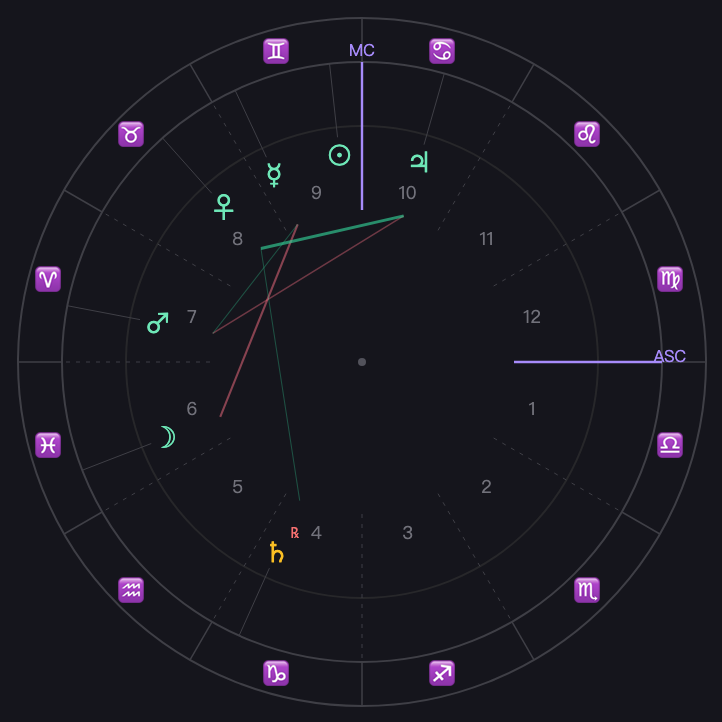
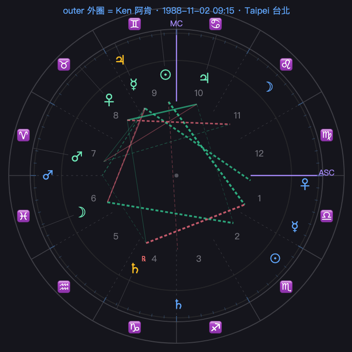

# Bazaar of Fates · 算命 Divination Suite

**Eleven traditional divination systems as deterministic Python engines**, behind one input — your **birth moment** (date + time + place) — each producing a reproducible chart plus an optional bilingual (English + 中文) AI reading. Plus a full **Western-astrology stack**: six house systems, transits, secondary & solar-arc progressions, Solar & Lunar Returns, life timelines, relationship charts (synastry / composite / Davison / group), and a cross-tradition annual report.

**十一套傳統命理系統**，寫成確定性 Python 排盤引擎，只吃一個輸入：**生辰**（日期＋時辰＋出生地），各自排出可重現的命盤＋可選的雙語 AI 解讀；外加完整西洋占星套件：六種宮位制、行運、二次／太陽弧推運、太陽／月亮回歸、大運時間軸、關係與團體合盤、跨系統年度報告。

<p align="center">
  
  
  <br/>
  <em>natal wheel 本命星盤 · synastry bi-wheel 合盤雙輪 — full visual guides in <a href="docs/README.md">docs/</a></em>
</p>

**Contents** · [Systems](#the-eleven-systems--十一系) · [Quickstart](#quickstart--快速開始) · [Guides](#guides--圖解指南) · [Features](#features--功能) · [API](#api) · [Architecture](#architecture--架構) · [Tests](#tests--測試)

> **Origin / 起源.** These engines began life as *placebo controls* in a larger quant project — divination cast as date-keyed trading signals, run through a lookahead-free backtest to prove they were noise. Here the **chart math is lifted out**, all trading/backtest stripped, and restored to its real purpose: **telling fortunes**. The 排盤 math is synced from the parent monorepo (single source of truth) via `scripts/sync_from_main.sh`; everything else — birth input, ascendant/house geometry, API, readings, web — is native to this repo.
>
> 這些引擎原本是某量化專案的「對照組／安慰劑」（把命理當訊號跑無未來函數回測，證明它們是雜訊）。這裡把排盤數學抽出、去掉交易回測，還原它本來的用途——算命。

## The eleven systems / 十一系

| key | System | 系統 | engine core | 時辰 | 出生地 |
|---|---|---|---|:--:|:--:|
| `astrology` | Western Astrology | 西洋占星 | `ephem` ecliptic longitudes | ✅ asc + houses | ✅ ascendant |
| `bazi` | BaZi · Four Pillars | 八字（四柱）| JDN-anchored 干支 | ✅ hour pillar | — |
| `ziwei` | Zi Wei Dou Shu | 紫微斗數 | pure-Python 排盤 | ✅ 命宮/身宮/局 | — |
| `iching` | Plum-Blossom I Ching | 梅花易數 | time-cast hexagram | — | — |
| `suimei` | Shichū-Suimei (JP) | 四柱推命（日）| 十二運星 + 天中殺 | ✅ | — |
| `qizheng` | Seven Luminaries | 七政四餘 | real astronomical longitudes | ✅ 命宮 | ✅ 命度/命宮 |
| `tieban` | Iron Plate | 鐵板神數 | 起命數 | — | — |
| `qimen` | Qi Men Dun Jia | 奇門遁甲 | 八門九宮起局 | — | — |
| `liuren` | Da Liu Ren | 大六壬 | 四課三傳 | — | — |
| `taiyi` | Tai Yi Shen Shu | 太乙神數 | 太乙九宮 | — | — |
| `jyotish` | Jyotiṣa (Vedic) | 吠陀占星 | sidereal + Vimśottarī daśā | ✅ Lagna + bhāva | ✅ Lagna |

> The synced engines compute planetary longitudes from the *date* alone (a stock has no hour or birthplace). `fortune/astro_ext.py` adds the **ascendant** and **houses** (needs time + place); `fortune/ziwei_ext.py` threads the real 時辰 into 紫微. Missing time/place → ascendant-based systems gracefully degrade to date-only and say so. / 缺時辰或出生地時自動退回只看日期並標註。

## Quickstart / 快速開始

```bash
python -m venv .venv && source .venv/bin/activate
pip install -e ".[dev,llm]"          # drop "llm" to stay on the mock reader / 省略 llm 即用 mock
cp .env.example .env

uvicorn fortune.api.main:app --reload         # backend API / 後端

# Front end — choose one / 前端二選一：
cd web && npm install && npm run dev          # (a) Next.js, full UI (node ≥ 20) → :3000
python -m http.server 5500 --directory web    # (b) static page, no build → :5500/index.html
```

Runs with **no LLM key**: every chart casts deterministically; only the prose reading is a mocked facts digest. Set `LLM_BACKEND=anthropic` + `ANTHROPIC_API_KEY` for a real bilingual AI reading. Point the web app at a non-default backend with `NEXT_PUBLIC_API_BASE`.
不接 LLM 也能跑：命盤照排，解讀走 mock；設金鑰即得真正的雙語 AI 解讀。

```bash
curl -s localhost:8000/cast/bazi -H 'content-type: application/json' -d '{
  "name":"Mei","birth_date":"1990-06-15","birth_time":"14:30",
  "gender":"female","place":"Taipei","latitude":25.04,"longitude":121.56
}' | jq .summary
# "日主 辛金・身弱（喜生扶）・喜用 土、金"
```

## Guides / 圖解指南

📖 **A non-engineer's visual guide for every system** — how to read each chart, with a real screenshot and a glossary. Index: **[docs/](docs/README.md)**.

[astrology](docs/astrology.md) · [bazi](docs/bazi.md) · [ziwei](docs/ziwei.md) · [iching](docs/iching.md) · [suimei](docs/suimei.md) · [qizheng](docs/qizheng.md) · [tieban](docs/tieban.md) · [qimen](docs/qimen.md) · [liuren](docs/liuren.md) · [taiyi](docs/taiyi.md) · [jyotish](docs/jyotish.md)

## Features / 功能

### Charts & houses 命盤與宮位
- Each system renders its own visual: the circular **星盤** (astrology), 南印度 **rāśi chart** (Jyotiṣa), **七政星盤**, the traditional **4×4 紫微 命盤**, **四柱** pillars, **hexagram** lines.
- Astrology supports six **house systems** (`house_system`): `whole_sign` (default) · `equal` · `placidus` · `koch` · `regiomontanus` · `campanus`.
- The four quadrant systems are **validated against Swiss Ephemeris to <0.006°** (Taipei / London / NYC / Sydney / Reykjavik 64°N); swisseph is a **dev-only oracle, not a runtime dependency**, and they fall back to whole-sign past the polar circle.
- The wheel draws house cusps as spokes (ASC/MC emphasised, house numbers), planets on an inner ring, and **aspect lines graded by orb** (tight = thick & bright).

### Readings 解讀
- Bilingual (English-then-中文) interpretation that reads **only the deterministic facts**.
- Astrology folds in the **chart ruler (命主星)**, angular planets, and the aspect list.
- Readings **stream** token-by-token over SSE (real Anthropic stream when keyed, chunked stub on mock).

### Timelines 時間軸 (rendered as a dated bar)
- **Jyotiṣa** Vimśottarī Mahādaśā (120-yr) · **BaZi** 大運 (10-yr luck pillars, direction by 年干陰陽 × gender) · **紫微** 流年四化 · **Astrology** Jupiter (~12 yr) & Saturn (~29.5 yr) returns.

### Overlays — transits, progressions & returns 行運・推運・回歸
An **Overlay** selector adds a second ring over the natal wheel; a **time slider** scrubs ±5 years and live-refreshes it via the LLM-free `/cast` (instant). Options:
- **Transits 行運** — any-day sky.
- **Progressions 推運** — **secondary** (1 day = 1 year) or **solar-arc** (the natal chart rotated rigidly by the Sun's arc).
- **Solar Return 太陽回歸** — the chart for the Sun's return to its natal longitude that year (annual chart), with its **own ascendant, houses, highlights, and the year's key transits**.
- **Lunar Return 月亮回歸** — the Moon's monthly return (month-ahead chart).

The overlay also draws a **double tick-ring** and the overlay chart's **own house cusps**. Extra detail:
- **Major transits 重要行運** — Jupiter/Saturn within 3° of a natal angle (ASC/MC/DSC/IC): gold halo, **graded by potency** (conjunction > square) and **phase** (solid ▸ applying / dashed ▹ separating), with the **exact-trigger date** (retrograde-aware).
- **Major progressions 重要推運** — progressed Moon's sign & house + next sign-ingress date; a flag when the progressed Sun changes sign.
- Every transit & progression aspect carries applying/separating + an **exact date**; solar-arc mode lists the **ages each natal planet is directed to an angle**.

### Relationships 合盤
- **`/synastry`** — two charts in one **bi-wheel** with cross-aspects, plus the **composite 組合中點盤** (longitude midpoints) and the **Davison 時空中點盤** (a real ephemeris chart at the midpoint moment+place, with a Saturn/Jupiter-return timeline). Each chart gets its own reading.
- **`/group`** (2–8 people) — a clickable net-score **matrix** (switch net / total / harmonious / challenging; reorder by compatibility or ▲▼), the standout pairs, a group reading, and the **group composite** (circular mean of all members).

### Annual report 年度報告
- **`/annual-report`** (one person + a year) assembles a cross-tradition forecast — Western **Solar Return**, **BaZi 流年/大運**, **紫微 流年四化**, **Jyotiṣa Mahādaśā** — and an LLM ties them into one bilingual year-ahead report. The UI's *Annual* mode renders it print-ready.

### Export 匯出
- Download any star/rāśi/七政 wheel as **PNG** (SVG→canvas, dependency-free), or **print** any reading / annual report to **PDF**.

## API

| method | path | |
|---|---|---|
| `GET` | `/systems` | the 11 systems + which cast cleanly / 11 系清單＋可用狀態 |
| `POST` | `/cast/{system}` | deterministic chart, no LLM → `Chart` |
| `POST` | `/reading/{system}` | chart + bilingual reading → `Reading` |
| `POST` | `/reading/{system}/stream` | SSE: a `chart` event then `delta` text events → progressive 解讀 |
| `POST` | `/timeline/{system}` | 大運 / Mahādaśā / 流年 / planet returns → `Timeline` |
| `POST` | `/synastry` | two births → bi-wheel + composite + Davison + readings → `Synastry` |
| `POST` | `/group` | 2–8 births → cross-aspect matrix + group composite + reading → `Group` |
| `POST` | `/annual-report` | one birth + year → SR + 八字流年/大運 + 紫微四化 + Jyotiṣa daśā + synthesis |

Astrology overlay params (on `/cast` query & `/reading` body): `house_system` · `transits` · `transit_date` · `progress` · `progress_method` (`secondary`\|`solar_arc`) · `solar_return` · `lunar_return`.

## Architecture / 架構

```
fortune/
  birth.py            BirthInput — the single input / 生辰輸入
  schemas.py          Chart / Reading / Timeline / Synastry / Group envelopes
  shared/             native: config / logging / llm (mock + anthropic, streaming)
  engines/<system>/   ← SYNCED 排盤 math from the monorepo (do NOT hand-edit)
  astro_ext.py        native: ascendant + 6 house systems (swisseph-validated)
  ziwei_ext.py        native: 紫微 with the real birth 時辰
  timeline.py         native: 大運 / Mahādaśā / 流年 / planet-return sequences
  casting/<system>.py per-system adapter: birth → engine fns → Chart (+ transits, aspects)
  casting/__init__.py registry of the 11 systems (lazy import)
  synastry.py         native: synastry + composite + Davison (+ returns)
  group.py            native: group matrix + group composite
  annual.py           native: cross-tradition annual report
  interpret.py        chart facts + tradition prompt → bilingual reading (sync + stream)
  api/main.py         FastAPI (systems / cast / reading[/stream] / timeline / synastry / group / annual-report)
prompts/<system>/     ← SYNCED reading prompts from the monorepo
web/                  Next.js app (app/page.tsx, lib/api.ts, app/_components/, app/_charts/)
                      + static index.html (no-build fallback)
docs/                 per-system visual guides + screenshots (img/)
scripts/              sync_from_main.sh (re-sync 排盤 math) · screenshots.py
```

### Re-syncing the engine math / 重新同步排盤數學

```bash
scripts/sync_from_main.sh                 # default monorepo ~/Desktop/威鯨面試_LLMEng
scripts/sync_from_main.sh /path/to/monorepo
```

Sync overwrites **only** `fortune/engines/*` and `prompts/*` (the 排盤 math + author prompts). Everything native — birth input, ascendant/house geometry, transits, synastry/group/annual, API, readings, the web app **including the chart renderers** — is never touched.
sync 只覆蓋排盤數學與門派 prompt；其餘原生檔（含星盤渲染器）不會被動到。

## Tests / 測試

```bash
pytest -q     # 64 tests
```

Coverage: every system casts a non-empty chart · all 6 house systems vs Swiss Ephemeris · transits with applying/separating + exact dates + graded major-transit highlights · secondary & solar-arc progressions + major progressions + directed-to-angles · Solar & Lunar Returns + highlights · aspect ranking · planet-return & Solar-Return-year timelines · synastry / composite / Davison / returns · group matrix & composite · annual report.

## License

For cultural, educational, and entertainment purposes. Divination is not a basis for financial, medical, or legal decisions.
僅供文化、教育與娛樂用途；命理不應作為財務、醫療或法律決策的依據。
