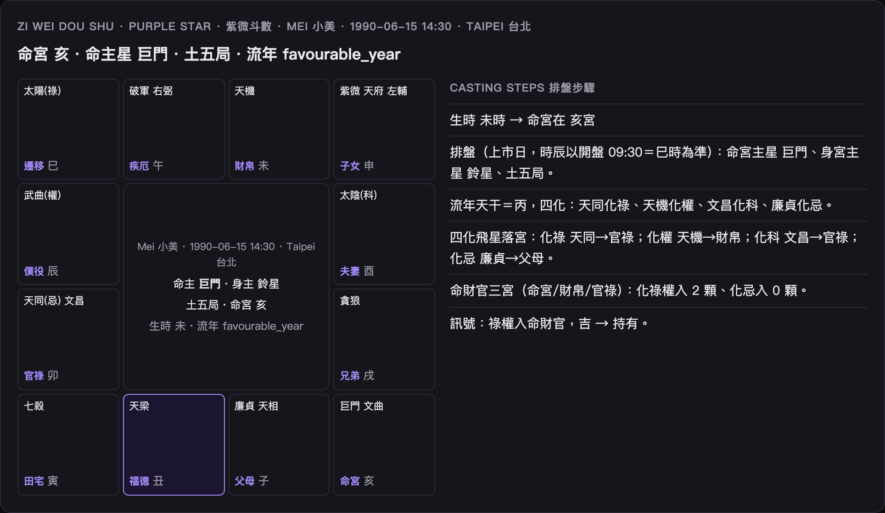
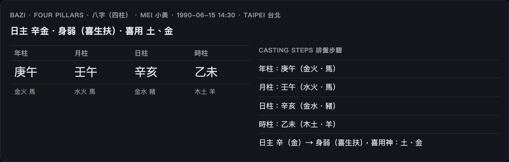
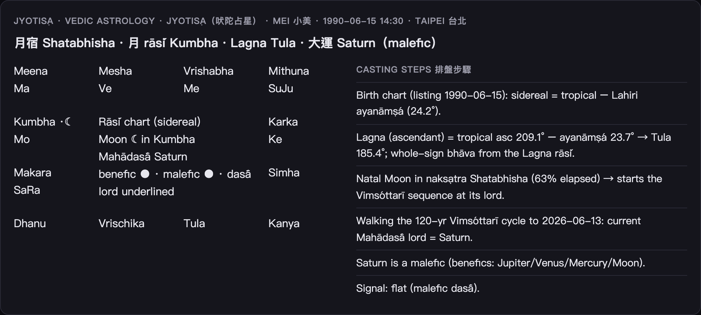
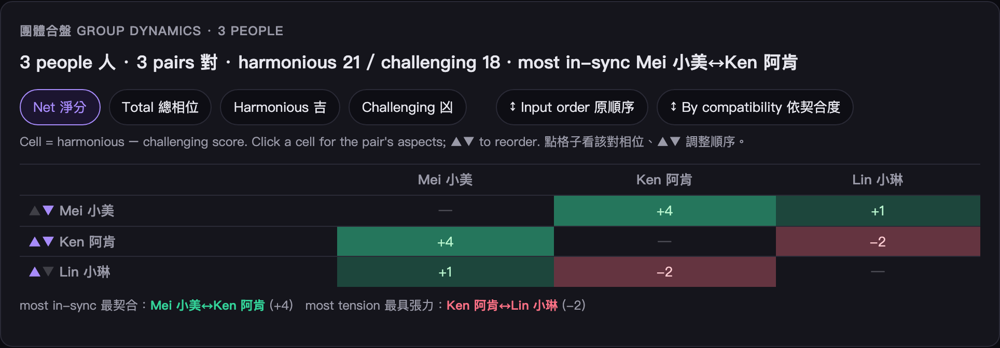
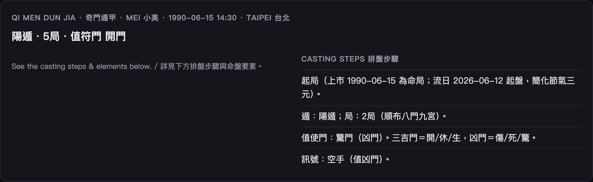
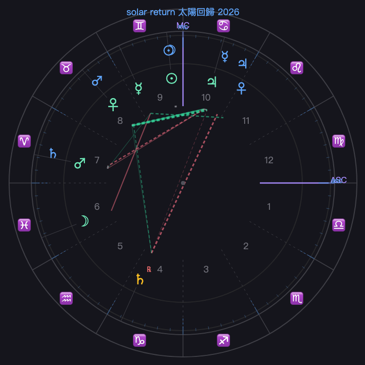
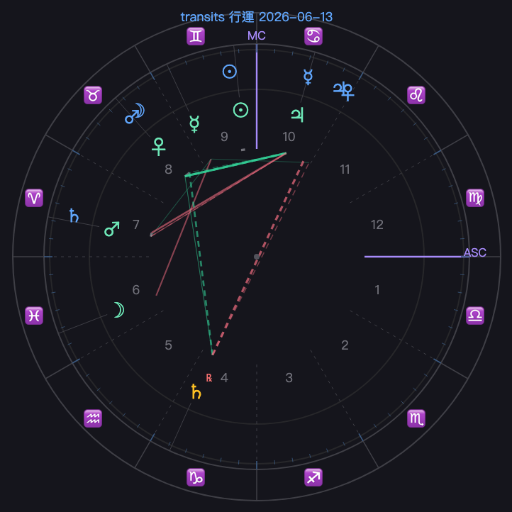

<div align="center">

# 🔮 Bazaar of Fates · 算命

### Eleven traditional divination systems, one birth moment, deterministic charts + bilingual AI readings.

*西洋占星 · 八字 · 紫微斗數 · 梅花易數 · 四柱推命 · 七政四餘 · 鐵板神數 · 奇門遁甲 · 大六壬 · 太乙神數 · Jyotiṣa*


<table>
  <tr>
    <td align="center"><br/><sub>Western natal wheel 西洋星盤</sub></td>
    <td align="center"><br/><sub>紫微斗數 12-palace board</sub></td>
    <td align="center"><br/><sub>Synastry bi-wheel 合盤雙輪</sub></td>
  </tr>
</table>

</div>

> ### 🃏 The twist / 緣起
> These eleven engines began life as **placebo controls** in a quantitative-finance project — divination cast as date-keyed trading signals, run through a lookahead-free backtest to *prove they were statistical noise*. We lifted out the chart math, stripped the trading, and gave them back their day job: **telling fortunes**.
> So yes — this fortune-teller is powered by signals we mathematically demonstrated are worthless. The astronomy underneath, though, is real (Swiss-Ephemeris-validated). Enjoy responsibly. 🔮
>
> 這十一套引擎原本是某量化專案的「對照組／安慰劑」——把命理當訊號跑無未來函數回測，**證明它們是雜訊**。這裡把排盤數學抽出、去掉交易，還給它們本來的工作：算命。

---

## ✨ Highlights

| | |
|---|---|
| 🌏 **11 systems, 1 input** | Western astrology, BaZi, 紫微, I Ching, Jyotiṣa & more — all from a single **birth moment**. |
| 🎯 **Deterministic + real astronomy** | Same birth → same chart, every time; planet positions via `ephem`, house systems **validated against Swiss Ephemeris to <0.006°**. |
| 🗣️ **Bilingual AI readings** | English-then-中文 interpretations that stream in token-by-token; runs fully offline (mock) with no API key. |
| 🪐 **A full Western stack** | 6 house systems · transits · secondary & solar-arc progressions · Solar & Lunar Returns · life timelines. |
| 💞 **Relationships & groups** | Synastry bi-wheel · composite · Davison · 2–8-person compatibility matrix. |
| 📅 **Forecasts** | Cross-tradition **annual report**, a multi-year **heatmap** with turning points, and **two-person arc** comparison. |
| 🖨️ **Share** | Export any chart to PNG; print any reading to PDF. |
| 📖 **A guide per system** | Plain-language, illustrated, bilingual — for non-astrologers. |

## 📸 Gallery — not just star charts

<table>
  <tr>
    <td align="center"><br/><sub>八字 four pillars</sub></td>
    <td align="center"><br/><sub>梅花易數 hexagram</sub></td>
    <td align="center"><br/><sub>Jyotiṣa rāśi chart</sub></td>
  </tr>
  <tr>
    <td align="center"><br/><sub>Group compatibility matrix 團體矩陣</sub></td>
    <td align="center"><br/><sub>Multi-year forecast heatmap 流年熱力圖</sub></td>
    <td align="center"><br/><sub>Two-person arc 雙人對照</sub></td>
  </tr>
  <tr>
    <td align="center"><br/><sub>奇門遁甲 九宮</sub></td>
    <td align="center"><br/><sub>Solar Return 太陽回歸</sub></td>
    <td align="center"><br/><sub>Transits overlay 行運</sub></td>
  </tr>
</table>

> 📖 **One visual guide per system** (how to read each chart, with screenshots): **[docs/](docs/README.md)** —
> [astrology](docs/astrology.md) · [bazi](docs/bazi.md) · [ziwei](docs/ziwei.md) · [iching](docs/iching.md) · [suimei](docs/suimei.md) · [qizheng](docs/qizheng.md) · [tieban](docs/tieban.md) · [qimen](docs/qimen.md) · [liuren](docs/liuren.md) · [taiyi](docs/taiyi.md) · [jyotish](docs/jyotish.md)

## ⚡ Quickstart

```bash
python -m venv .venv && source .venv/bin/activate
pip install -e ".[dev,llm]"          # drop "llm" to stay on the mock reader / 省略 llm 即用 mock
cp .env.example .env

uvicorn fortune.api.main:app --reload         # backend API → :8000

# Front end — pick one / 前端二選一：
cd web && npm install && npm run dev          # (a) Next.js, full UI (node ≥ 20) → :3000
python -m http.server 5500 --directory web    # (b) static page, no build → :5500/index.html
```

No LLM key needed — every chart casts deterministically and the reading falls back to a faithful facts digest. Set `LLM_BACKEND=anthropic` + `ANTHROPIC_API_KEY` for real bilingual AI prose.

```bash
curl -s localhost:8000/cast/bazi -H 'content-type: application/json' -d '{
  "name":"Mei","birth_date":"1990-06-15","birth_time":"14:30",
  "gender":"female","place":"Taipei","latitude":25.04,"longitude":121.56
}' | jq .summary
# "日主 辛金・身弱（喜生扶）・喜用 土、金"
```

## 🧭 The eleven systems

| key | System | 系統 | engine core | 時辰 | 出生地 |
|---|---|---|---|:--:|:--:|
| `astrology` | Western Astrology | 西洋占星 | `ephem` ecliptic longitudes | ✅ asc + houses | ✅ ascendant |
| `bazi` | BaZi · Four Pillars | 八字（四柱）| JDN-anchored 干支 | ✅ hour pillar | — |
| `ziwei` | Zi Wei Dou Shu | 紫微斗數 | pure-Python 排盤 | ✅ 命宮/身宮/局 | — |
| `iching` | Plum-Blossom I Ching | 梅花易數 | time-cast hexagram | — | — |
| `suimei` | Shichū-Suimei (JP) | 四柱推命（日）| 十二運星 + 天中殺 | ✅ | — |
| `qizheng` | Seven Luminaries | 七政四餘 | real astronomical longitudes | ✅ 命宮 | ✅ 命度/命宮 |
| `tieban` | Iron Plate | 鐵板神數 | 起命數 | — | — |
| `qimen` | Qi Men Dun Jia | 奇門遁甲 | 八門九宮起局 | — | — |
| `liuren` | Da Liu Ren | 大六壬 | 四課三傳 | — | — |
| `taiyi` | Tai Yi Shen Shu | 太乙神數 | 太乙九宮 | — | — |
| `jyotish` | Jyotiṣa (Vedic) | 吠陀占星 | sidereal + Vimśottarī daśā | ✅ Lagna + bhāva | ✅ Lagna |

> Missing birth time/place → ascendant-based systems gracefully degrade to date-only and say so. / 缺時辰或出生地時自動退回只看日期並標註。

## 🧩 Features

### Charts & houses 命盤與宮位
- Each system renders its own visual: the circular **星盤** (astrology), 南印度 **rāśi chart** (Jyotiṣa), **七政星盤**, the **4×4 紫微 命盤**, **四柱** pillars, **hexagram** lines.
- Astrology supports six **house systems**: `whole_sign` (default) · `equal` · `placidus` · `koch` · `regiomontanus` · `campanus` — the four quadrant systems **validated against Swiss Ephemeris to <0.006°** (swisseph is a dev-only oracle, not a runtime dep).
- The wheel draws house cusps as spokes (ASC/MC emphasised), planets on an inner ring, and **aspect lines graded by orb** (tight = thick & bright).

### Readings 解讀
- Bilingual (English-then-中文) interpretation that reads **only the deterministic facts** (chart ruler 命主星, angular planets, aspects woven in).
- **Streams** token-by-token over SSE; real Anthropic stream when keyed, chunked stub on mock.

### Overlays — transits, progressions & returns 行運・推運・回歸
An **Overlay** selector adds a second ring; a **time slider** scrubs ±5 years, live via the LLM-free `/cast`.
- **Transits 行運** (any-day sky) · **Progressions 推運** (secondary 1 day = 1 year, or solar-arc) · **Solar Return 太陽回歸** (annual chart) · **Lunar Return 月亮回歸** (monthly).
- **Major transits 重要行運**: a slow planet on a natal angle, gold halo, graded by potency & **applying ▸ / separating ▹** phase, with the **exact-trigger date**.
- Every aspect carries phase + an exact date; solar-arc lists the **ages each planet is directed to an angle**.

### Relationships 合盤
- **`/synastry`** — bi-wheel + cross-aspects, the **composite** (longitude midpoints) and the **Davison** (a real chart at the midpoint moment+place, with a returns timeline). Each gets a reading.
- **`/group`** (2–8 people) — a clickable net-score **matrix** (net / total / harmonious / challenging; reorderable), standout pairs, and the **group composite**.

### Forecasts 流年
- **`/annual-report`** — one year across Solar Return (with its wheel), 八字流年/大運, 紫微四化, Jyotiṣa daśā + a synthesis.
- **`/annual-overview`** — a multi-year **heatmap**: per-year favourability colour blocks, a score **trend line** with hover nodes, **typed turning markers** (♄ Saturn return · ♃ Jupiter · 運 大運 · ↻ daśā · ☯ 八字 flip), **click a year** to expand it, and **drag to zoom**.
- **Two-person comparison** — overlay both arcs, flag **契合年 ✦** (best shared years), drag-to-zoom.

## 🔌 API

| method | path | |
|---|---|---|
| `GET` | `/systems` | the 11 systems + which cast cleanly |
| `POST` | `/cast/{system}` | deterministic chart, no LLM → `Chart` |
| `POST` | `/reading/{system}` `[/stream]` | chart + bilingual reading (`/stream` = SSE) → `Reading` |
| `POST` | `/timeline/{system}` | 大運 / Mahādaśā / 流年 / planet returns → `Timeline` |
| `POST` | `/synastry` · `/group` | relationship / group charts + readings |
| `POST` | `/annual-report` · `/annual-overview` | one-year report / multi-year arc |

Astrology overlay params (on `/cast` query & `/reading` body): `house_system` · `transits` · `transit_date` · `progress` · `progress_method` · `solar_return` · `lunar_return`.

## 🏗️ Architecture

```
fortune/
  birth.py            BirthInput — the single input / 生辰輸入
  engines/<system>/   ← SYNCED 排盤 math from the parent monorepo (do NOT hand-edit)
  astro_ext.py        native: ascendant + 6 house systems (swisseph-validated)
  ziwei_ext.py        native: 紫微 with the real birth 時辰
  timeline.py         native: 大運 / Mahādaśā / 流年 / planet-return sequences
  casting/<system>.py per-system adapter: birth → engine fns → Chart
  synastry.py · group.py · annual.py   native: relationships / group / forecasts
  interpret.py        chart facts + tradition prompt → bilingual reading (sync + stream)
  api/main.py         FastAPI
web/                  Next.js app + static index.html (no-build fallback)
docs/                 per-system visual guides + screenshots
scripts/              sync_from_main.sh (re-sync 排盤 math) · screenshots.py
```

The 排盤 math is synced from the parent quant monorepo (single source of truth) via `scripts/sync_from_main.sh`, which overwrites **only** `fortune/engines/*` and `prompts/*`. Everything else — ascendant/house geometry, transits, synastry/group/annual, API, readings, the web app **including the chart renderers** — is native to this repo and never touched by sync.

## ✅ Tests

```bash
pytest -q     # 66 tests
```

Every system casts · 6 house systems vs Swiss Ephemeris · transits (applying/separating, exact dates, major-transit highlights) · progressions (secondary & solar-arc, major progressions, directed-to-angles) · Solar & Lunar Returns · aspect ranking · planet-return & SR-year timelines · synastry / composite / Davison · group matrix & composite · annual report & multi-year overview.

## 📜 License

For cultural, educational, and entertainment purposes. Divination is **not** a basis for financial, medical, or legal decisions.
僅供文化、教育與娛樂用途；命理不應作為財務、醫療或法律決策的依據。
