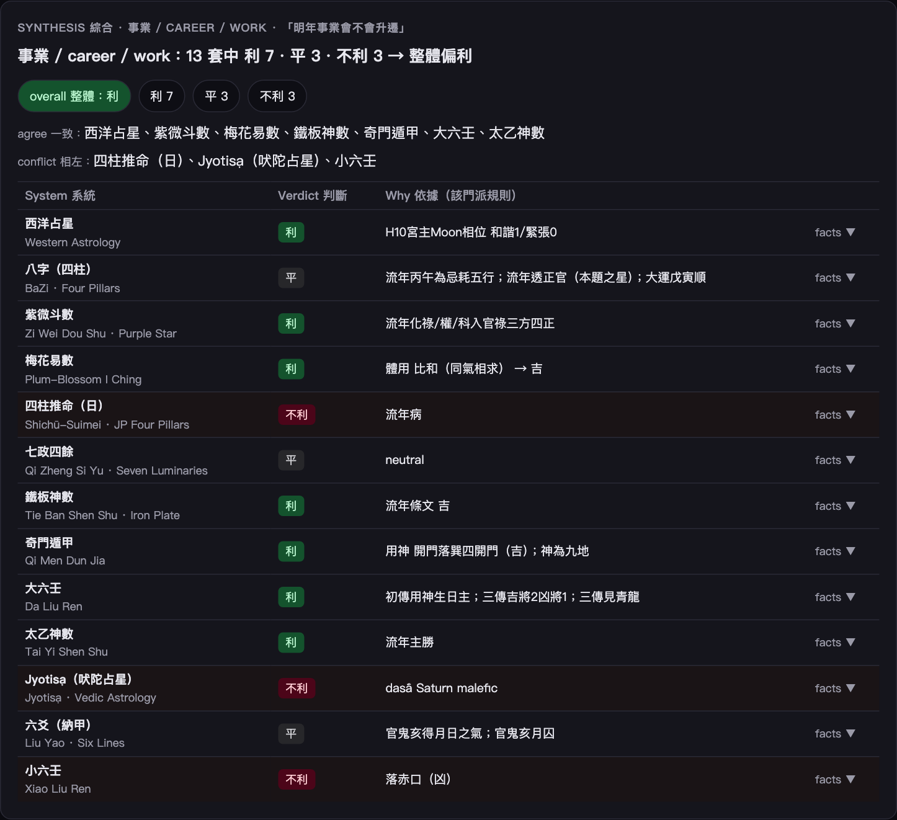
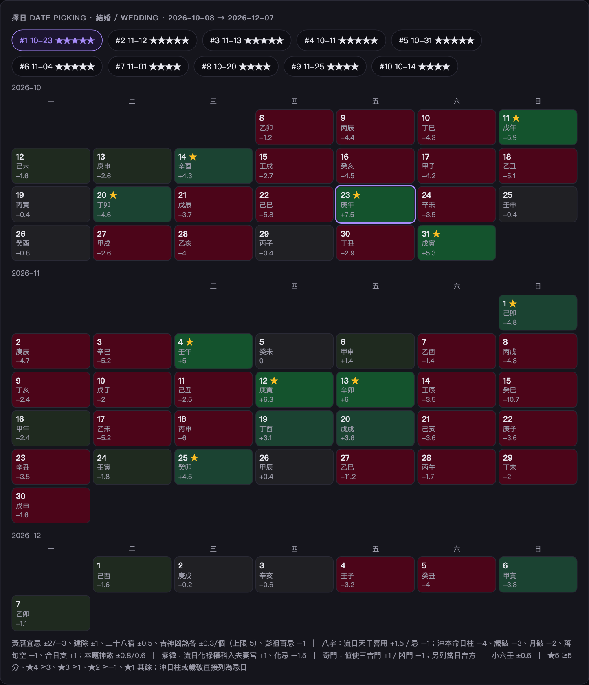
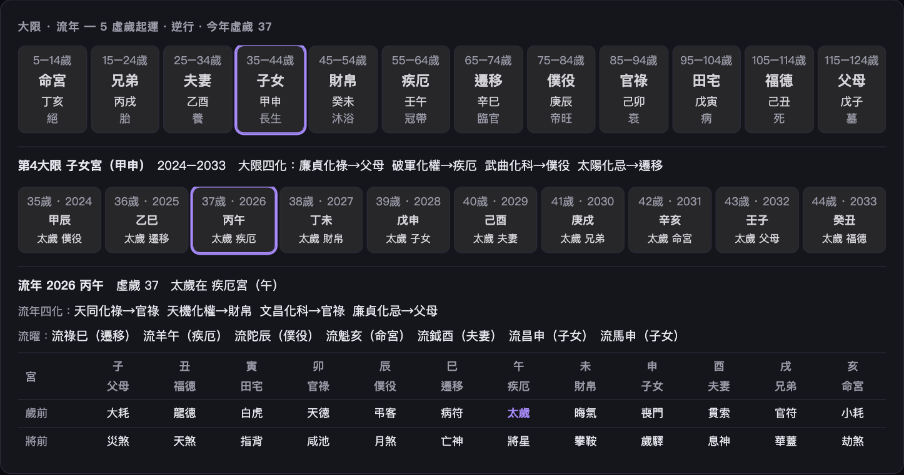
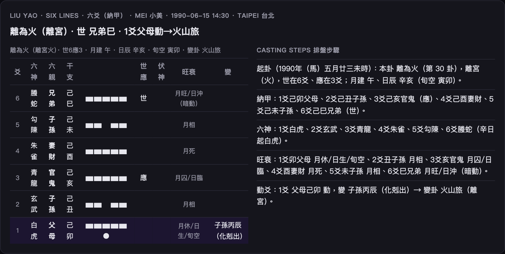
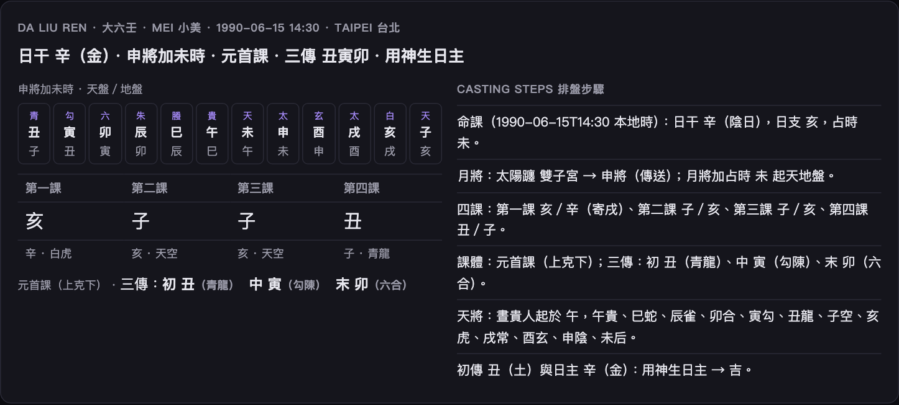

<div align="center">

# 🔮 Bazaar of Fates · 算命

### Thirteen traditional divination systems, one birth moment — exact astronomy, auditable charts, readings in your language.

*西洋占星 · 八字 · 紫微斗數 · 梅花易數 · 六爻 · 小六壬 · 四柱推命 · 七政四餘 · 鐵板神數 · 奇門遁甲 · 大六壬 · 太乙神數 · Jyotiṣa*


**English** · [繁體中文](README.zh-TW.md) · [简体中文](README.zh-CN.md)

### 👉 [Try it online / 線上試玩](https://ms57rd-bazaar-of-fates.hf.space) — no install, no API key

```bash
pip install bazaar-of-fates && bazaar bazi 1990-06-15 14:30 --place 台北 --gender female
```


<table>
  <tr>
    <td align="center"><br/><sub>Western natal wheel 西洋星盤</sub></td>
    <td align="center"><br/><sub>紫微斗數 12-palace board</sub></td>
    <td align="center"><br/><sub>八字 full almanac sheet</sub></td>
  </tr>
</table>

</div>

## ✨ What it does

| | |
|---|---|
| 🌏 **13 systems, 1 input** | One birth moment → every chart. Type a city and lat/lon/time zone fill in (Taiwan historical DST applied); optional **true solar time** for the 干支 systems. |
| 🎯 **Real astronomy, exact to the minute** | Planets at the **exact birth instant, true equinox of date** (`ephem`); all **24 節氣** to the minute; six house systems **validated against Swiss Ephemeris to <0.006°**. |
| 🔍 **Every chart is auditable** | Each cast lists its reasoning: every term of the 八字 旺衰 score, the 六壬 course-type rule used, the 奇門 遁/元/局 derivation, every +/− of a 擇日 score. Cross-validated in tests against **Swiss Ephemeris, x-iztro (iztro), kinliuren, kinqimen, lunar-python** — the whole 518,400-chart 紫微 input space matches iztro. |
| 🧾 **八字 full sheet** | 十神 · 藏干 · 納音 · 空亡 · 神煞 · 十二長生 · 胎元命宮 · 起運交運 · 刑沖合會 · 稱骨 · 黃曆, an auditable **旺衰 / 用神 / 調候 / 格局** analysis, 大運 → 流年 → 流月 drill-down. |
| 🌟 **紫微** | 36 stars + x-iztro brightness, 雜曜, 格局; 閏月 / 晚子時 conventions; **大限 → 流年** panel (四化落宮, 流曜, 歲前/將前). |
| 🧑‍⚖️ **Synthesis 綜合會診** | One question → all 13 systems, each with its own rule-based verdict and reason, agreement/conflict tallied, then one reading that explains why traditions differ. |
| 📅 **Date picking 擇日 · 今日運勢** | Purpose (結婚/開業/搬家/簽約/手術/出行/求財) + range → every day scored from 黃曆, 八字 流日 (沖日柱/歲破/月破/空亡/神煞), 紫微 流日四化, 奇門 值使 + 吉方, 小六壬; calendar view, best 時辰 per day. |
| 🗣️ **Readings in your language** | 中文 / English / both, streamed token-by-token. Ask a question and the prompt leads with the facts that bear on it. Runs fully offline (facts digest) with no API key. |
| 🪐 **Western stack** | 6 house systems · transits · secondary & solar-arc progressions · Solar & Lunar Returns · planet-return timelines. |
| 💞 **Relationships & forecasts** | Synastry bi-wheel · composite · Davison · 2–8-person matrix · cross-tradition annual report · multi-year heatmap with turning points · two-person arc. |
| 💘 **Love-specialist reader 感情專科** | One question type, read deeply: natal love disposition (八字 配偶星・夫妻宮, 紫微 夫妻宮, 西洋 金星・七宮, Jyotiṣa 七宮), a **桃花年／婚緣年** scan with every +/− listed, **合婚** (八字 日柱干支 + synastry) when a partner is given, and a reading that answers the sub-question (何時有緣／合不合／復合／該不該分開／婚姻／第三者) first. Rules: [docs/love.md](docs/love.md). |
| 🩺 **Specialist readers 專科** | Five more one-topic readers on the same skeleton — **career 事業** (官殺・提綱, 官祿宮, 十宮・土星, 第十 bhāva + a 事業方向 sheet), **wealth 財運** (財星・財庫 opened by 流年沖, 財帛宮, 二宮・木星 + 財性 sheet), **health 健康** (五行分布→臟腑, 疾厄宮, 六宮 + 體質 sheet; never medical advice), **study 學業** (印星・文昌學堂, 父母宮・昌曲, 九宮・水星 + 學習型態／科系 sheet), **family 家庭** (年柱父母宮・時柱子女宮・子女星, 田宅宮, 四宮・月亮 + 六親 sheet). Each: natal, this year, a yearly scan with every +/− listed, sub-question first. Rules: [docs/specialists.md](docs/specialists.md). |
| 🤖 **CLI · API · MCP** | `bazaar` in the terminal, FastAPI with SSE streaming, `bazaar-mcp` for Claude / Cursor, a Claude Code skill, a one-page printable report. |
| 🗃️ **Datasets** | One command enumerates the entire 紫微 input space (518,400 charts, with 7-topic rule verdicts) or 八字 by date range. |

## 📸 Gallery

<table>
  <tr>
    <td align="center"><br/><sub>Synthesis 綜合會診</sub></td>
    <td align="center"><br/><sub>擇日 date picking</sub></td>
    <td align="center"><br/><sub>紫微 大限 → 流年</sub></td>
  </tr>
  <tr>
    <td align="center"><br/><sub>六爻 納甲</sub></td>
    <td align="center"><br/><sub>奇門遁甲 九宮</sub></td>
    <td align="center"><br/><sub>大六壬 天地盤・四課三傳</sub></td>
  </tr>
  <tr>
    <td align="center"><br/><sub>Synastry bi-wheel 合盤</sub></td>
    <td align="center"><br/><sub>Multi-year heatmap 流年熱力圖</sub></td>
    <td align="center"><br/><sub>Jyotiṣa rāśi chart</sub></td>
  </tr>
</table>

> 📖 **A visual guide per system** (how to read each chart): **[docs/](docs/README.md)** —
> [astrology](docs/astrology.md) · [bazi](docs/bazi.md) · [ziwei](docs/ziwei.md) · [iching](docs/iching.md) · [liuyao](docs/liuyao.md) · [xiaoliuren](docs/xiaoliuren.md) · [suimei](docs/suimei.md) · [qizheng](docs/qizheng.md) · [tieban](docs/tieban.md) · [qimen](docs/qimen.md) · [liuren](docs/liuren.md) · [taiyi](docs/taiyi.md) · [jyotish](docs/jyotish.md) · [擇日 rules](docs/zeri.md)
> · 🧾 one-page **[full report](docs/img/full-report.png)** (`/report`, print → PDF)

## ⚡ Quickstart

**Terminal (no server, no key)**

```bash
pip install bazaar-of-fates                      # or run once: uvx bazaar-of-fates …
bazaar bazi 1990-06-15 14:30 --place 台北 --gender female     # 八字 sheet in the terminal
bazaar ziwei 1990-06-15 14:30 --place 台北 --gender female    # 紫微 4×4 board
bazaar synthesis 1990-06-15 14:30 --gender female --ask "明年事業"      # 13 systems, one question
bazaar zeri 1990-06-15 14:30 --purpose wedding --from 2026-11-01 --to 2026-12-31   # 擇日
bazaar today 1990-06-15 14:30                    # 今日運勢
bazaar love 1990-06-15 14:30 --gender female --ask "何時有正緣" --years 8        # 感情專科：命・桃花年・(合婚 with --partner-date)
bazaar career 1990-06-15 14:30 --gender female --ask "該不該轉職"                 # 專科：career | wealth | health | study | family
bazaar all 1990-06-15 14:30 --json               # everything as JSON; add --read for a reading
```

**Full web app (Next.js) from source**

```bash
git clone https://github.com/ChiShengChen/bazaar-of-fates && cd bazaar-of-fates
python3.11 -m venv .venv && source .venv/bin/activate      # 3.10–3.13
pip install -e ".[dev,llm,oracles]"   # llm = Anthropic reader (optional); oracles = x-iztro, opencc… (optional)
cp .env.example .env
uvicorn fortune.api.main:app --reload            # API → :8000 (also serves the no-build static page at /)
cd web && npm install && npm run dev             # full UI → :3000 (node ≥ 20)
```

No LLM key needed — every chart casts deterministically and the reading falls back to a faithful facts digest. Set `LLM_BACKEND=anthropic` + `ANTHROPIC_API_KEY` for AI prose; pick the reading language in the UI or with `lang`.

```bash
curl -s localhost:8000/cast/bazi -H 'content-type: application/json' \
  -d '{"name":"Mei","birth_date":"1990-06-15","birth_time":"14:30","gender":"female","place":"Taipei"}' | jq .summary
# "日主 辛金・身弱（喜生扶）・喜用 土、金"
```

## 🧭 The thirteen systems

| key | System | 系統 | engine | 時辰 | 出生地 |
|---|---|---|---|:--:|:--:|
| `astrology` | Western Astrology | 西洋占星 | `ephem`, equinox of date; 6 house systems; transits, progressions, returns | ✅ | ✅ |
| `bazi` | BaZi · Four Pillars | 八字（四柱）| exact-節氣 干支; full almanac sheet; 旺衰/用神; 大運流年流月流日 | ✅ | — |
| `ziwei` | Zi Wei Dou Shu | 紫微斗數 | native 安星 (36 stars) + x-iztro; 大限/流年 | ✅ | — |
| `iching` | Plum-Blossom I Ching | 梅花易數 | 年月日時起卦 (農曆), 體用生剋 | ✅ | — |
| `liuyao` | Liu Yao | 六爻（納甲）| 京房納甲 · 八宮世應 · 六親六神 · 伏神 · 旺衰 | ✅ | — |
| `xiaoliuren` | Xiao Liu Ren | 小六壬 | 月日時 六宮 | ✅ | — |
| `suimei` | Shichū-Suimei (JP) | 四柱推命（日）| 十二運星 + 天中殺 | ✅ | — |
| `qizheng` | Seven Luminaries | 七政四餘 | real longitudes + 四餘 mean elements; 命度起宮 | ✅ | ✅ |
| `tieban` | Iron Plate | 鐵板神數 | 太玄數 起命數 (honest stand-in) | ✅ | — |
| `qimen` | Qi Men Dun Jia | 奇門遁甲 | 時家轉盤, 拆補法 / 置閏法 | ✅ | — |
| `liuren` | Da Liu Ren | 大六壬 | 月將加時 · 四課三傳 · 九宗門 · 十二天將 | ✅ | — |
| `taiyi` | Tai Yi Shen Shu | 太乙神數 | 太乙八宮 (simplified) | — | — |
| `jyotish` | Jyotiṣa (Vedic) | 吠陀占星 | sidereal (Lahiri) at the birth instant; Vimśottarī daśā | ✅ | ✅ |

> Missing birth time or place → ascendant-based systems fall back to date-only and say so. / 缺時辰或出生地時自動退回並標註。

## 🧩 Features in depth

### Charts 命盤
- Each system renders its own visual: the circular **星盤**, the 南印度 **rāśi chart**, the **七政星盤**, the 4×4 **紫微 board**, the **八字 sheet**, **hexagram** / **納甲** tables, the 奇門 **九宮**, the 六壬 **天地盤**.
- **八字**: exact-節氣 pillars, 十神 · 藏干 · 納音 · 空亡 · 神煞 · 十二長生, 胎元/命宮, 起運/交運 to the hour, 刑沖合會, 稱骨, 黃曆 (二十八宿, 建除, 宜忌…), an auditable 旺衰 / 用神 / 調候 / 格局 analysis, 大運 → 流年 → 流月 drill-down, 流日/流時.
- **紫微**: 36 stars with 十二長生 / 博士十二神 per palace, brightness 廟旺利陷, 雜曜 and 格局 (x-iztro), 大限 → 流年 (大限/流年四化 + landing, 流曜, 歲前/將前十二神).
- **大六壬**: all nine course types (賊克/比用/涉害/遙克/昴星/別責/八專/伏吟/返吟) with 十二天將. **奇門**: 拆補 or 置閏, 值符/值使, 九星八門八神, 吉方.
- **Western**: six house systems; the wheel draws cusps as spokes, planets on an inner ring, aspect lines graded by orb.

### Readings 解讀
- The model reads **only** the deterministic facts (the `reasoning_chain` is the audit trail). With a question (`focus`), the prompt leads with the facts that bear on it — 八字 本題十神, 紫微 本題宮位三方四正 + 四化, 六爻 用神, Western/Jyotiṣa 本題宮位, 奇門 用神落宮, 六壬 三傳天將 — plus that tradition's own rule-based verdict.
- 中文 / English / both; streams over SSE (real Anthropic stream when keyed, chunked facts digest on mock).

### Synthesis 綜合會診 · Dates 擇日
- `/synthesis`: every system's verdict on one question side by side, tally, consensus and conflicts, panel reading. The table needs no LLM.
- `/zeri`: each day in a range scored from 黃曆 宜忌/建除/宿/神煞, 八字 流日 (喜用, 沖日柱 −4, 歲破 −3, 月破 −2, 旬空, 合日支, purpose 神煞), 紫微 流日四化 into the purpose palace, 奇門 值使 + 吉方, 小六壬 — every term listed; best days get 12 scored 時辰. `/day` is today's outlook. Rules: [docs/zeri.md](docs/zeri.md).

### Overlays, relationships, forecasts
- **Transits** (any day, time slider ±5 years) · **Progressions** (secondary / solar-arc, directed-to-angle ages) · **Solar & Lunar Returns** with highlights and the year's key transits.
- **Synastry** bi-wheel + cross-aspects, **composite**, **Davison** (with its own returns timeline); **group** matrix (2–8 people) + group composite.
- **Annual report** across Solar Return, 八字流年/大運, 紫微四化, Jyotiṣa daśā; **multi-year heatmap** with trend line and typed turning markers; **two-person arc** comparison.

## 🤖 MCP server & Claude Code skill

```bash
pip install "bazaar-of-fates[mcp]"
# Claude Desktop / Claude Code / Cursor:
# {"mcpServers": {"bazaar-of-fates": {"command": "bazaar-mcp"}}}
```

Tools: `list_systems` · `geo_lookup` · `cast` · `reading` · `synthesis` · `zeri` · `day` · `synastry` — every result carries the chart's `reasoning_chain`, so the model reads from facts. Skill: [`skills/bazaar-of-fates/SKILL.md`](skills/bazaar-of-fates/SKILL.md). Directory listings and launch copy: [docs/LAUNCH.md](docs/LAUNCH.md).

## 🐳 Deploy

- **Live demo**: [https://ms57rd-bazaar-of-fates.hf.space](https://ms57rd-bazaar-of-fates.hf.space) — a Gradio Space (files in [deploy/hf-space/](deploy/hf-space/)) with the API at `/docs` and the static page at `/web/`.
- **Docker** (any host): `docker build -t bazaar . && docker run -p 7860:7860 bazaar` → API + static page on :7860, mock reader, no key. See [deploy/hf-space-README.md](deploy/hf-space-README.md).
- Set `LLM_BACKEND=anthropic` + `ANTHROPIC_API_KEY` for AI readings.

## 🔌 API

| method | path | |
|---|---|---|
| `GET` | `/systems` · `/geo?q=&on=` · `/cities` | the 13 systems; birthplace → lat/lon/tz (offline table, Taiwan DST by date) |
| `POST` | `/cast/{system}` | deterministic chart, no LLM → `Chart` |
| `POST` | `/reading/{system}` `[/stream]` | chart + reading (`focus`, `lang`; `/stream` = SSE) → `Reading` |
| `POST` | `/synthesis` | one question across all (or chosen) systems: verdicts + facts, tally, consensus/conflicts, panel reading |
| `POST` | `/zeri` · `/day` | date picking for a purpose (scored days, best/avoid, 吉時, 吉方) · one day's outlook with 12 時辰 |
| `POST` | `/love` | love-specialist sitting: natal disposition, this year's 13-system lean, 桃花年／婚緣年 scan, 合婚 with a partner, reading |
| `POST` | `/consult/{topic}` · `GET /consult` | specialist sitting for career / wealth / health / study / family (`auto` routes by the question): natal, this year, yearly scan, the topic sheet, reading |
| `POST` | `/timeline/{system}` | 大運 / Mahādaśā / 流年 / planet returns → `Timeline` |
| `POST` | `/synastry` · `/group` | relationship / group charts + readings |
| `POST` | `/annual-report` · `/annual-overview` | one-year report / multi-year arc |

Options: astrology `house_system` · `transits` · `transit_date` · `progress` · `progress_method` · `solar_return` · `lunar_return`; 奇門 `qimen_method` (`chaibu` | `zhirun`); `BirthInput.true_solar_time`; `lang` (`zh` | `en` | `both`, default `both`); `focus` for question-oriented extraction. Supported birth years: 1900–2099.

## 🏗️ Architecture

```
fortune/
  birth.py            BirthInput — the single input / 生辰輸入
  engines/<system>/   per-system primitives + tables (干支 anchors, 五虎遁/五鼠遁, 紫微 安星, 六十四卦, Vimśottarī…)
  astro_ext.py        time-exact, equinox-of-date planets; ascendant + 6 house systems (swisseph-validated)
  bazi_ext.py         full 八字 sheet — exact 24 節氣, 十神/藏干/納音/空亡/神煞, 旺衰/用神, 起運, 大運/流年/流月/流日, 稱骨, 真太陽時
  ziwei_ext.py        紫微 with the real 時辰, 閏月/晚子時, 36 stars, 大限/流年, x-iztro enrichment
  jyotish_ext.py      grahas / nakṣatra / Vimśottarī daśā at the exact birth instant
  qimen_ext.py        時家奇門 轉盤 起局, 拆補法 / 置閏法 (遁/元/局, 地盤, 值符值使, 天盤 九星八門八神)
  liuren_ext.py       大六壬 九宗門 + 十二天將
  liuyao_ext.py       六爻 納甲 / 八宮世應 / 六親六神 / 伏神 / 旺衰
  lunar.py            農曆 conversion (lunar-python → sxtwl → lunardate; lunardate has 3 wrong months)
  geo.py              offline city → lat/lon/tz, Taiwan historical DST
  almanac.py          黃曆 block via lunar-python (正體 via OpenCC)
  casting/<system>.py per-system adapter: birth → Chart (the 13 systems)
  focus.py            question → topic; per-system relevant facts + rule-based verdict; cross-system tally
  zeri.py             擇日 scorer + daily outlook
  timeline.py · synastry.py · group.py · annual.py   life timelines, relationships, forecasts
  interpret.py        facts + tradition prompt → reading (zh / en / both), synthesis & 擇日 prompts
  api/main.py         FastAPI (+ serves web/index.html)
  cli.py              `bazaar` terminal CLI · mcp_server.py  `bazaar-mcp` MCP server
web/                  Next.js app + static index.html (no-build fallback)
docs/                 per-system guides, 擇日 rules, credits, launch kit, screenshots
scripts/              screenshots, hero GIF / social card, full-space check, dataset builder
deploy/               Hugging Face Space app, Dockerfile companion README
skills/               Claude Code skill
```

## ✅ Tests

```bash
pytest -q     # 165 tests
```

Every system casts · reference 節氣 instants (USNO, 台北市曆象表) · planets and six house systems vs Swiss Ephemeris · the 八字 sheet vs a published 排盤 · 旺衰/起運/真太陽時/geo-DST · 紫微 placement, 長生/博士, 大限 vs x-iztro · 六壬 四課/天將/課體 vs kinliuren · 奇門 局/值符值使/盤 vs kinqimen · 四柱/節氣/大運 vs lunar-python · transits, progressions, returns, synastry, group, annual · focus extraction, synthesis, 擇日, CLI, MCP. Cross-validation tests skip when the optional packages are absent.

## 🗃️ Datasets（no LLM needed）

```bash
python scripts/ziwei_fullspace_check.py                                  # native 紫微 vs x-iztro, all 518,400 charts — 0 mismatches
python scripts/build_dataset.py ziwei --out data/ziwei.jsonl.gz          # the whole 紫微 input space (60 年干支 × 12 月 × 30 日 × 12 時辰 × 2)
python scripts/build_dataset.py bazi  --out data/bazi.jsonl.gz --years 1960-2030   # 八字 by solar date × 12 時辰 × 2 (~622k rows)
```

Each row is a complete deterministic chart (紫微: palaces with brightness/雜曜, 命主身主局, 生年四化, 12 大限; 八字: exact-節氣 四柱 with 十神/藏干/納音/空亡/神煞, 胎元命宮, 旺衰/用神/格局, 起運, 9 大運, 稱骨) plus a rule-based verdict + facts for seven topics — a reading skeleton for fine-tuning, RAG, or diffing against another engine. `--liunian` adds the per-year lists; `--asof` fixes the "today". Output is gzipped JSONL under `data/` (git-ignored; ≈ 350 MB / 190 MB).

## 📰 Changelog

- **2026-10-09** — PyPI package + `bazaar` CLI, `bazaar-mcp` MCP server + Claude Code skill, live Hugging Face Space, Dockerfile, MIT licence, 繁中/简中 READMEs, hero GIF; full-space check against iztro (which exposed three wrong month lengths in `lunardate` — the 農曆 layer now prefers lunar-python / 壽星萬年曆); dataset builder.
- **2026-10-08** — 擇日 + 今日運勢 (流日/流時); question-oriented readings, Synthesis mode, reading language switch; 六爻 and 小六壬 (13 systems); x-iztro / lunar-python enrichment; cross-validation tests against five sibling engines; 八字 旺衰/用神/格局 analysis, true solar time, birthplace lookup with Taiwan DST, 紫微 大限/流年, 六壬 九宗門, 奇門 置閏, one-page report; the 八字 full almanac sheet; and the accuracy audit — time-exact equinox-of-date planets (the old date-only positions put ~11% of Moon signs and ~25% of nakṣatras in the wrong place), 六壬 月將, real hours for 四柱推命/鐵板.

## 🙏 Acknowledgements / 引用

Built on **PyEphem** and **lunar-python**; optionally enriched by **x-iztro** (iztro port — 紫微 brightness, 雜曜, 格局) and **OpenCC**; cross-validated in the test suite against **x-iztro**, **kinliuren**, **kinqimen**, **lunar-python** and **Swiss Ephemeris**; rules consulted from **mingpan**, **jishiyu** and **ziwei-doushu**. Full list with licences and how each is used: **[docs/CREDITS.md](docs/CREDITS.md)**.

## 📜 License

[MIT](LICENSE). For cultural, educational, and entertainment purposes. Divination is **not** a basis for financial, medical, or legal decisions.
僅供文化、教育與娛樂用途；命理不應作為財務、醫療或法律決策的依據。
