<div align="center">

# 🔮 Bazaar of Fates · 算命

### Thirteen traditional divination systems, one birth moment, deterministic charts + bilingual AI readings.

*西洋占星 · 八字 · 紫微斗數 · 梅花易數 · 六爻 · 小六壬 · 四柱推命 · 七政四餘 · 鐵板神數 · 奇門遁甲 · 大六壬 · 太乙神數 · Jyotiṣa*


<table>
  <tr>
    <td align="center">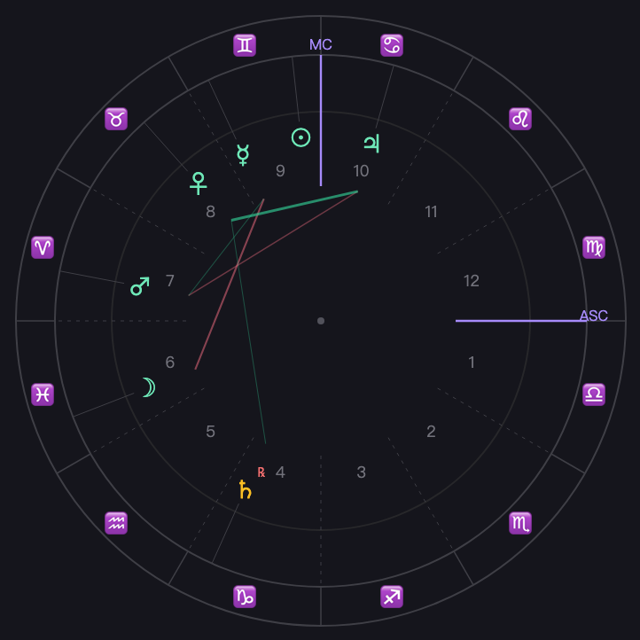<br/><sub>Western natal wheel 西洋星盤</sub></td>
    <td align="center">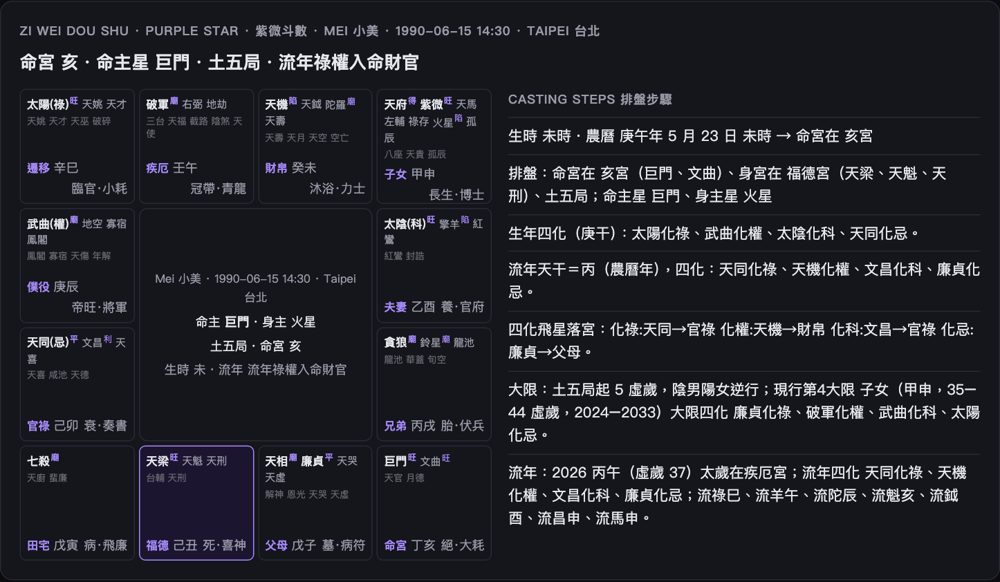<br/><sub>紫微斗數 12-palace board</sub></td>
    <td align="center">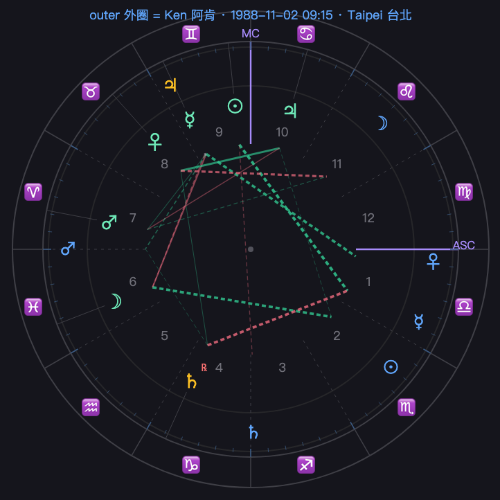<br/><sub>Synastry bi-wheel 合盤雙輪</sub></td>
  </tr>
</table>

</div>

> ### 📰 News / 更新
> **2026-10-08** — three commits, one audit:
> - **Accuracy fixes 演算法修正** — planets are now computed at the **exact birth instant on the true equinox of date** (the old date-only J2000 positions put ~11% of Moon signs and ~25% of Jyotiṣa nakṣatras in the wrong place, and skewed Solar/Lunar Returns); 大六壬 月將 mapping corrected; 四柱推命 / 鐵板 use the real hour and exact 節氣.
> - **八字 full almanac sheet 完整排盤** — 十神 · 藏干 · 納音 · 空亡 · 神煞 · 胎元命宮 · 起運交運 · 稱骨, an auditable **旺衰 / 用神 / 調候 / 格局** analysis, and a clickable 大運 → 流年 → 流月 drill-down. All 24 節氣 to the minute.
> - **More of each tradition** — 紫微: 36 stars, 閏月/晚子時 conventions, **大限 → 流年** panel; 梅花: classical 年月日時起卦; 奇門: 時家轉盤 **拆補 / 置閏**; 六壬: all **nine course types**.
> - **2026-10-08 (later)** — **13 systems**: 六爻（納甲）and 小六壬 added; 紫微 gains star brightness / 雜曜 / 格局 from **x-iztro**, 八字 gains a 黃曆 block from **lunar-python**, 六壬 gains 十二天將. Every native engine is now **cross-validated in tests** against lunar-python, x-iztro, kinliuren, kinqimen and Swiss Ephemeris — see [docs/CREDITS.md](docs/CREDITS.md).
> - **2026-10-08 (dates)** — **擇日 / 今日運勢**: a purpose + a date range → every day scored from 黃曆, 八字 流日, 紫微 流日四化, 奇門 and 小六壬 (rules listed per day), calendar view, best 時辰 and 吉方; 八字 流日/流時 added.
> - **2026-10-08 (readings)** — question-oriented prompts (the facts that bear on what you asked lead the prompt, with each tradition's own rule-based verdict), a **Synthesis 綜合** mode that puts all 13 systems' verdicts on one question side by side with agreement/conflict, and a reading **language** switch (中文 / English / both).
> - **Input & output** — type a city and lat/lon/time zone fill in (Taiwan historical DST applied), optional **true solar time**, and a one-page **full report** (`/report`) for all 11 systems → PDF.

## ✨ Highlights

| | |
|---|---|
| 🌏 **13 systems, 1 input** | Western astrology, BaZi, 紫微, I Ching, Jyotiṣa & more — all from a single **birth moment**. Type a city and the lat/lon/time zone fill in (Taiwan historical DST applied); optional **true solar time** for the 干支 systems. |
| 🎯 **Deterministic + real astronomy** | Same birth → same chart, every time; planets at the **exact birth instant, true equinox of date** via `ephem`, house systems **validated against Swiss Ephemeris to <0.006°**, 24 節氣 to the minute. |
| 🗣️ **AI readings, your language** | 中文 / English / bilingual interpretations that stream token-by-token; runs fully offline (mock) with no API key. Ask a question and the prompt leads with the facts that bear on it (八字 本題十神, 紫微 本題宮位三方四正 + 四化, 六爻 用神, 西占/Jyotiṣa 本題宮位…), each tradition's own rule-based verdict included. |
| 📅 **Date picking 擇日 · 今日運勢** | Pick a purpose (結婚/開業/搬家/簽約/手術/出行/求財) and a range: every day scored from 黃曆 宜忌, 八字 流日 (喜用, 沖日柱/歲破/月破/空亡, 神煞), 紫微 流日四化, 奇門 值使 + 吉方 and 小六壬 — ranked on a calendar with the best 時辰 of each top day; or today's outlook with 12 時辰. |
| 🧑‍⚖️ **Synthesis 綜合會診** | One question → all 13 systems cast, each gives a deterministic verdict with its reason, agreement and conflicts tallied, then one panel reading that explains why traditions differ. |
| 🪐 **A full Western stack** | 6 house systems · transits · secondary & solar-arc progressions · Solar & Lunar Returns · life timelines. |
| 💞 **Relationships & groups** | Synastry bi-wheel · composite · Davison · 2–8-person compatibility matrix. |
| 📅 **Forecasts** | Cross-tradition **annual report**, a multi-year **heatmap** with turning points, and **two-person arc** comparison. |
| 🖨️ **Share** | Export any chart to PNG; print any reading to PDF; a one-page **full report** (`/report`) with all 11 systems + this year's outlook. |
| 📖 **A guide per system** | Plain-language, illustrated, bilingual — for non-astrologers. |

## 📸 Gallery — not just star charts

<table>
  <tr>
    <td align="center">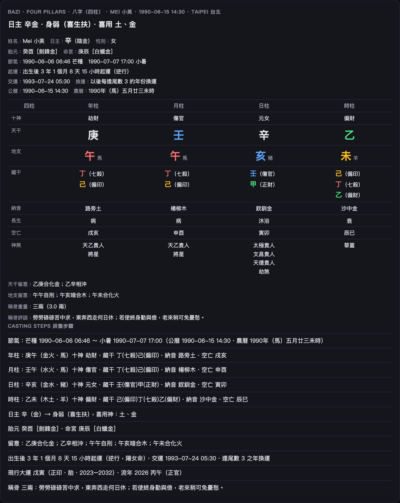<br/><sub>八字 four pillars</sub></td>
    <td align="center">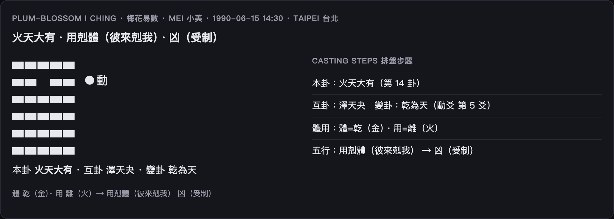<br/><sub>梅花易數 hexagram</sub></td>
    <td align="center">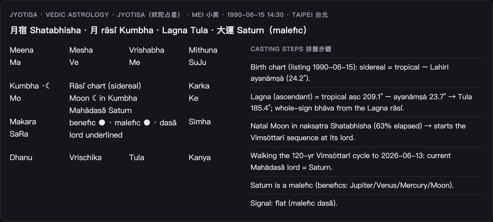<br/><sub>Jyotiṣa rāśi chart</sub></td>
  </tr>
  <tr>
    <td align="center">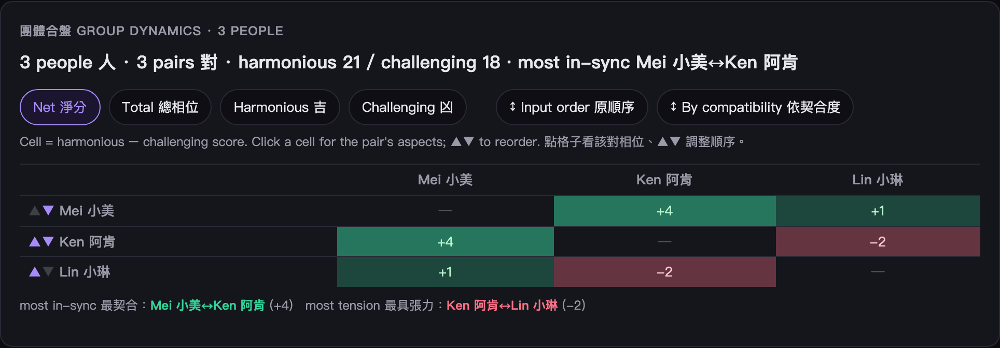<br/><sub>Group compatibility matrix 團體矩陣</sub></td>
    <td align="center">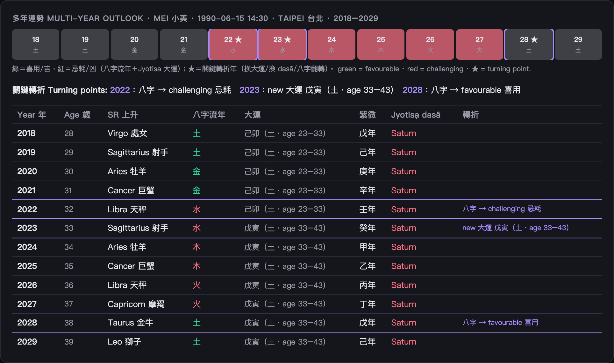<br/><sub>Multi-year forecast heatmap 流年熱力圖</sub></td>
    <td align="center">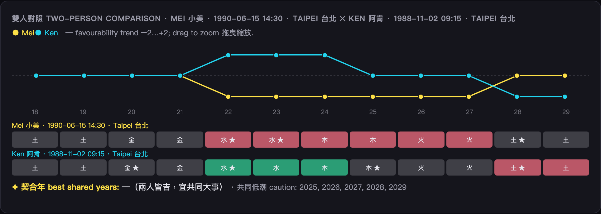<br/><sub>Two-person arc 雙人對照</sub></td>
  </tr>
  <tr>
    <td align="center">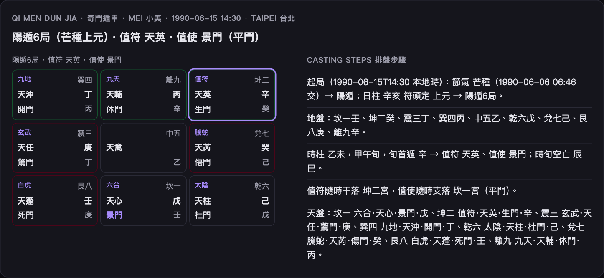<br/><sub>奇門遁甲 九宮</sub></td>
    <td align="center">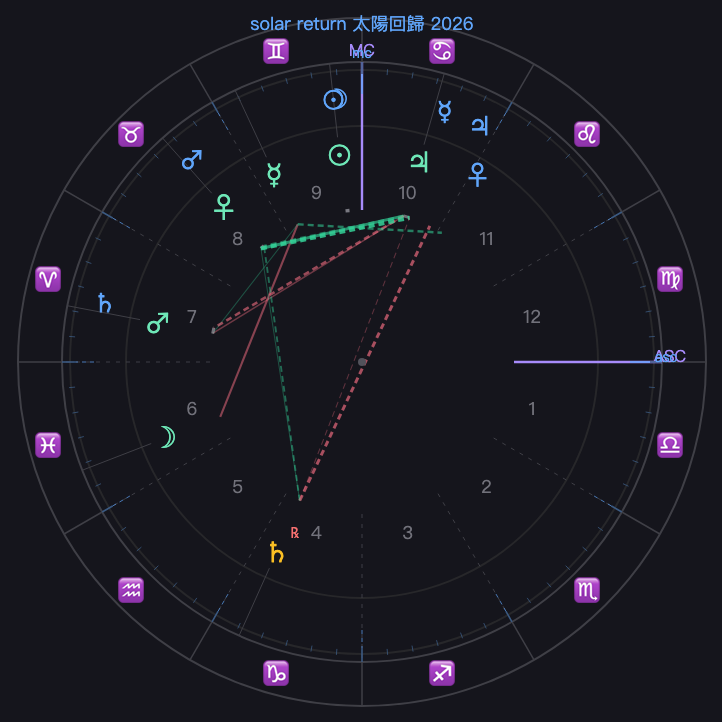<br/><sub>Solar Return 太陽回歸</sub></td>
    <td align="center">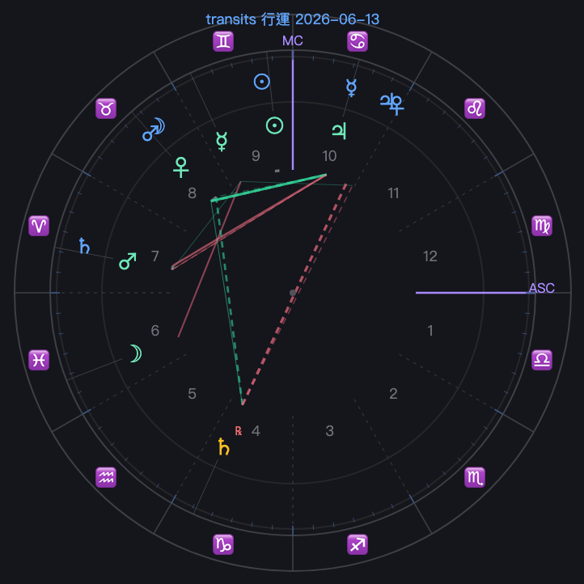<br/><sub>Transits overlay 行運</sub></td>
  </tr>
</table>

> 📖 **One visual guide per system** (how to read each chart, with screenshots): **[docs/](docs/README.md)** —
> [astrology](docs/astrology.md) · [bazi](docs/bazi.md) · [ziwei](docs/ziwei.md) · [iching](docs/iching.md) · [suimei](docs/suimei.md) · [qizheng](docs/qizheng.md) · [tieban](docs/tieban.md) · [qimen](docs/qimen.md) · [liuren](docs/liuren.md) · [taiyi](docs/taiyi.md) · [jyotish](docs/jyotish.md)

> 🧾 **Full report** — every system on one printable page: [`/report`](docs/img/full-report.png)

## ⚡ Quickstart

```bash
python3.11 -m venv .venv && source .venv/bin/activate   # 3.10–3.13 (ephem wheels); 3.14 untested
pip install -e ".[dev,llm,oracles]"  # drop "llm" for the mock reader; "oracles" = optional sibling engines (x-iztro, lunar-python…)
cp .env.example .env

uvicorn fortune.api.main:app --reload         # backend API → :8000

# Front end — pick one / 前端二選一：
cd web && npm install && npm run dev          # (a) Next.js, full UI (node ≥ 20) → :3000
python -m http.server 5500 --directory web    # (b) static page, no build → :5500/index.html
```

No LLM key needed — every chart casts deterministically and the reading falls back to a faithful facts digest. Set `LLM_BACKEND=anthropic` + `ANTHROPIC_API_KEY` for real bilingual AI prose.

```bash
curl -s localhost:8000/cast/bazi -H 'content-type: application/json' -d '{
  "name":"Mei","birth_date":"1990-06-15","birth_time":"14:30",
  "gender":"female","place":"Taipei","latitude":25.04,"longitude":121.56
}' | jq .summary
# "日主 辛金・身弱（喜生扶）・喜用 土、金"
```

## 🧭 The thirteen systems

| key | System | 系統 | engine core | 時辰 | 出生地 |
|---|---|---|---|:--:|:--:|
| `astrology` | Western Astrology | 西洋占星 | `ephem` ecliptic longitudes | ✅ asc + houses | ✅ ascendant |
| `bazi` | BaZi · Four Pillars | 八字（四柱）| JDN-anchored 干支 | ✅ hour pillar | — |
| `ziwei` | Zi Wei Dou Shu | 紫微斗數 | pure-Python 排盤 | ✅ 命宮/身宮/局 | — |
| `iching` | Plum-Blossom I Ching | 梅花易數 | 年月日時起卦 (農曆) | ✅ 下卦/動爻 | — |
| `suimei` | Shichū-Suimei (JP) | 四柱推命（日）| 十二運星 + 天中殺 | ✅ 時柱 | — |
| `qizheng` | Seven Luminaries | 七政四餘 | real astronomical longitudes | ✅ 命宮 | ✅ 命度/命宮 |
| `tieban` | Iron Plate | 鐵板神數 | 太玄數 起命數 (stand-in) | ✅ 時柱 | — |
| `qimen` | Qi Men Dun Jia | 奇門遁甲 | 時家轉盤・拆補法 | ✅ 時干支 | — |
| `liuren` | Da Liu Ren | 大六壬 | 月將加時・四課三傳（賊克/比用）| ✅ 占時 | — |
| `taiyi` | Tai Yi Shen Shu | 太乙神數 | 太乙八宮 (simplified) | — | — |
| `jyotish` | Jyotiṣa (Vedic) | 吠陀占星 | sidereal + Vimśottarī daśā | ✅ Lagna + bhāva | ✅ Lagna |
| `liuyao` | Liu Yao | 六爻（納甲）| 京房納甲 · 八宮世應 · 六親六神 · 伏神 · 旺衰 | ✅ 起卦/日辰 | — |
| `xiaoliuren` | Xiao Liu Ren | 小六壬 | 月日時 六宮 | ✅ | — |

> Missing birth time/place → ascendant-based systems gracefully degrade to date-only and say so. / 缺時辰或出生地時自動退回只看日期並標註。

## 🧩 Features

### Charts & houses 命盤與宮位
- Each system renders its own visual: the circular **星盤** (astrology), 南印度 **rāśi chart** (Jyotiṣa), **七政星盤**, the **4×4 紫微 命盤**, **四柱** pillars, **hexagram** lines.
- **八字** is a full almanac sheet: exact-節氣 pillars, **十神 · 藏干 · 納音 · 空亡 · 神煞 · 十二長生**, 胎元 / 命宮, 農曆, **起運 / 交運** to the hour, 天干地支 **刑沖合會** notes, 袁天罡 **稱骨**, an auditable **旺衰 / 用神 / 調候 / 格局** analysis, and a clickable **大運 → 流年 → 流月** drill-down (with per-year 神煞 + relations).
- **紫微** has 36 stars with 十二長生 / 博士十二神 per palace and a **大限 → 流年** drill-down (大限四化, 流年四化 + landing, 流曜, 歲前/將前十二神). **大六壬** judges all nine course types; **奇門** offers 拆補 / 置閏.
- Astrology supports six **house systems**: `whole_sign` (default) · `equal` · `placidus` · `koch` · `regiomontanus` · `campanus` — the four quadrant systems **validated against Swiss Ephemeris to <0.006°** (swisseph is a dev-only oracle, not a runtime dep).
- The wheel draws house cusps as spokes (ASC/MC emphasised), planets on an inner ring, and **aspect lines graded by orb** (tight = thick & bright).

### Readings 解讀
- Bilingual (English-then-中文) interpretation that reads **only the deterministic facts** (chart ruler 命主星, angular planets, aspects woven in).
- **Streams** token-by-token over SSE; real Anthropic stream when keyed, chunked stub on mock.

### Overlays — transits, progressions & returns 行運・推運・回歸
An **Overlay** selector adds a second ring; a **time slider** scrubs ±5 years, live via the LLM-free `/cast`.
- **Transits 行運** (any-day sky) · **Progressions 推運** (secondary 1 day = 1 year, or solar-arc) · **Solar Return 太陽回歸** (annual chart) · **Lunar Return 月亮回歸** (monthly).
- **Major transits 重要行運**: a slow planet on a natal angle, gold halo, graded by potency & **applying ▸ / separating ▹** phase, with the **exact-trigger date**.
- Every aspect carries phase + an exact date; solar-arc lists the **ages each planet is directed to an angle**.

### Relationships 合盤
- **`/synastry`** — bi-wheel + cross-aspects, the **composite** (longitude midpoints) and the **Davison** (a real chart at the midpoint moment+place, with a returns timeline). Each gets a reading.
- **`/group`** (2–8 people) — a clickable net-score **matrix** (net / total / harmonious / challenging; reorderable), standout pairs, and the **group composite**.

### Forecasts 流年
- **`/annual-report`** — one year across Solar Return (with its wheel), 八字流年/大運, 紫微四化, Jyotiṣa daśā + a synthesis.
- **`/annual-overview`** — a multi-year **heatmap**: per-year favourability colour blocks, a score **trend line** with hover nodes, **typed turning markers** (♄ Saturn return · ♃ Jupiter · 運 大運 · ↻ daśā · ☯ 八字 flip), **click a year** to expand it, and **drag to zoom**.
- **Two-person comparison** — overlay both arcs, flag **契合年 ✦** (best shared years), drag-to-zoom.

## 🔌 API

| method | path | |
|---|---|---|
| `GET` | `/systems` | the 11 systems + which cast cleanly |
| `GET` | `/geo?q=&on=` · `/cities` | birthplace → lat/lon/tz (offline table, Taiwan DST by date) |
| `POST` | `/cast/{system}` | deterministic chart, no LLM → `Chart` |
| `POST` | `/reading/{system}` `[/stream]` | chart + bilingual reading (`/stream` = SSE) → `Reading` |
| `POST` | `/timeline/{system}` | 大運 / Mahādaśā / 流年 / planet returns → `Timeline` |
| `POST` | `/synastry` · `/group` | relationship / group charts + readings |
| `POST` | `/annual-report` · `/annual-overview` | one-year report / multi-year arc |
| `POST` | `/zeri` · `/day` | date picking over a range for a purpose (scored days, best/avoid, 吉時, 吉方) · one day's outlook with 12 時辰 |
| `POST` | `/synthesis` | one question across all (or chosen) systems: per-system verdict + facts, tally, consensus/conflicts, panel reading |

Astrology overlay params (on `/cast` query & `/reading` body): `house_system` · `transits` · `transit_date` · `progress` · `progress_method` · `solar_return` · `lunar_return`; 奇門: `qimen_method` (`chaibu` | `zhirun`). `BirthInput.true_solar_time` casts the 干支 systems on true solar time. `lang` (`zh` | `en` | `both`, default `both`) on every reading request; `focus` turns on question-oriented extraction. Supported birth years: 1900–2099 (農曆 table range).

## 🏗️ Architecture

```
fortune/
  birth.py            BirthInput — the single input / 生辰輸入
  engines/<system>/   per-system 排盤 engine cores (calendar / ephemeris primitives + tables)
  astro_ext.py        native: ascendant + 6 house systems (swisseph-validated)
  ziwei_ext.py        native: 紫微 with the real birth 時辰, 閏月/晚子時 conventions, 輔星/煞星
  bazi_ext.py         native: full 八字 sheet — exact 24 節氣, 十神/藏干/納音/空亡/神煞, 起運, 大運/流年/流月, 稱骨
  jyotish_ext.py      native: grahas / nakṣatra / Vimśottarī daśā at the exact birth instant
  qimen_ext.py        native: 時家奇門 轉盤 起局, 拆補法 / 置閏法 (遁/元/局, 地盤, 值符值使, 天盤 九星八門八神)
  liuren_ext.py       native: 大六壬 九宗門 (賊克/比用/涉害/遙克/昴星/別責/八專/伏吟/返吟)
  geo.py              native: offline city → lat/lon/tz, Taiwan historical DST
  liuyao_ext.py       native: 六爻 納甲 / 八宮世應 / 六親六神 / 伏神 / 旺衰
  almanac.py          optional: 黃曆 block via lunar-python
  timeline.py         native: 大運 / Mahādaśā / 流年 / planet-return sequences
  casting/<system>.py per-system adapter: birth → engine fns → Chart
  synastry.py · group.py · annual.py   native: relationships / group / forecasts
  zeri.py             擇日 scorer (黃曆 + 八字流日 + 紫微流日 + 奇門 + 小六壬) and the daily outlook
  focus.py            question → topic; per-system relevant facts + rule-based verdict; cross-system tally
  interpret.py        chart facts + tradition prompt → reading (zh / en / both, sync + stream), synthesis prompt
  api/main.py         FastAPI
web/                  Next.js app + static index.html (no-build fallback)
docs/                 per-system visual guides + screenshots
scripts/              screenshots.py (doc screenshots via Playwright)
```

`fortune/engines/` holds the low-level primitives and tables per system (干支 calendar anchors, 五虎遁/五鼠遁, 紫微 安星, 六十四卦, Vimśottarī tables…). The `*_ext.py` modules and `fortune/casting/` adapters build the actual charts on top of them: exact 節氣, time-exact planet positions, ascendant/house geometry, transits, synastry/group/annual, the full 八字/紫微/六壬/奇門 sheets, API, readings and the web app.

## ✅ Tests

```bash
pytest -q     # 96 tests (5 cross-validate against sibling engines when installed)
```

Every system casts · 6 house systems vs Swiss Ephemeris · transits (applying/separating, exact dates, major-transit highlights) · progressions (secondary & solar-arc, major progressions, directed-to-angles) · Solar & Lunar Returns · aspect ranking · planet-return & SR-year timelines · synastry / composite / Davison · group matrix & composite · annual report & multi-year overview.

## 🙏 Acknowledgements / 引用

Built on **PyEphem** and **lunardate**; optionally enriched by **x-iztro** (iztro port — 紫微 brightness, 雜曜, 格局) and **lunar-python** (黃曆); cross-validated in the test suite against **lunar-python**, **x-iztro**, **kinliuren**, **kinqimen** and **Swiss Ephemeris**; rules consulted from **mingpan**, **jishiyu** and **ziwei-doushu**. Full list with licences and how each is used: **[docs/CREDITS.md](docs/CREDITS.md)**.

## 📜 License

For cultural, educational, and entertainment purposes. Divination is **not** a basis for financial, medical, or legal decisions.
僅供文化、教育與娛樂用途；命理不應作為財務、醫療或法律決策的依據。
