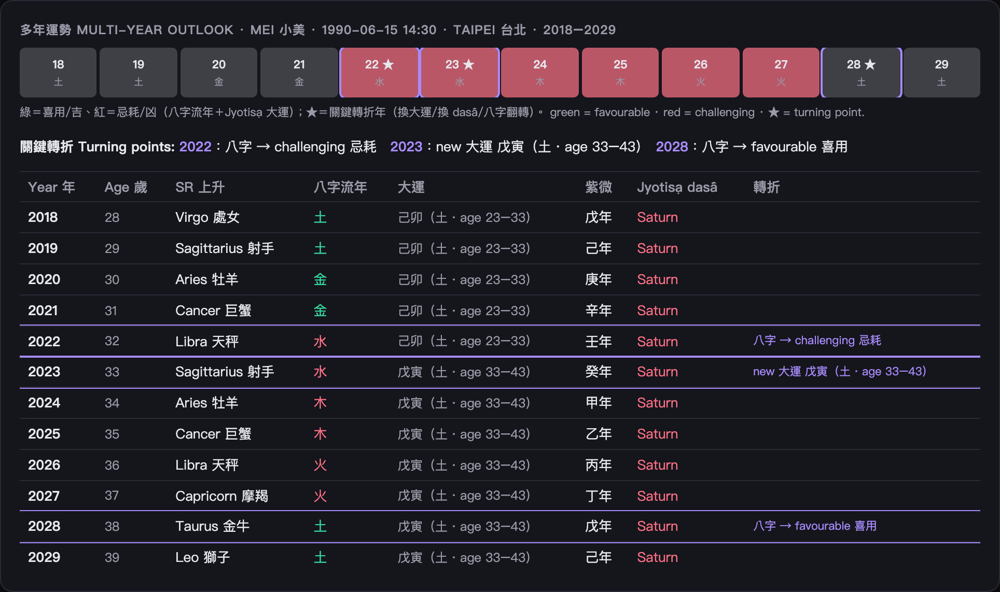
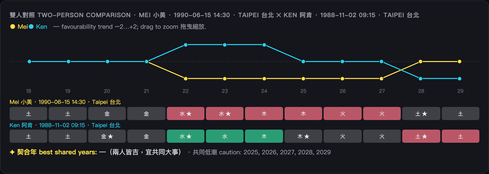

# 圖解指南 · Visual Guides

給非工程的人看的說明：每一套命理系統怎麼讀。每篇先一句白話，再講盤面與名詞。
Plain-language guides — what each divination system is and how to read its chart. No maths required.

| 系統 System | 指南 Guide |
|---|---|
| 西洋占星 Western Astrology | [astrology.md](astrology.md) — 星盤、宮位、行運、推運、回歸、合盤、團體 |
| 八字（四柱）BaZi | [bazi.md](bazi.md) — 四柱、日主、五行喜用、大運 |
| 紫微斗數 Zi Wei Dou Shu | [ziwei.md](ziwei.md) — 12 宮命盤、命主星、四化、流年 |
| 梅花易數 Plum-Blossom I Ching | [iching.md](iching.md) — 本卦/互卦/變卦、體用生剋 |
| 四柱推命（日）Shichū-Suimei | [suimei.md](suimei.md) — 十二運星、天中殺、藏干 |
| 七政四餘 Seven Luminaries | [qizheng.md](qizheng.md) — 七政四餘、命宮、流年 |
| 鐵板神數 Iron Plate | [tieban.md](tieban.md) — 命數、流年數 |
| 奇門遁甲 Qi Men Dun Jia | [qimen.md](qimen.md) — 八門九宮、值符門 |
| 大六壬 Da Liu Ren | [liuren.md](liuren.md) — 四課三傳、日干 |
| 太乙神數 Tai Yi Shen Shu | [taiyi.md](taiyi.md) — 太乙九宮、主客 |
| Jyotiṣa 吠陀占星 | [jyotish.md](jyotish.md) — rāśi 盤、月宿、Daśā 大運 |

## 年度報告 / Annual outlook

跨系統的**年度報告**（太陽回歸＋八字流年大運＋紫微四化＋Jyotiṣa 大運）與**多年走勢**——逐年吉凶色塊（綠＝喜用、紅＝忌耗）＋自動標出**關鍵轉折年**（換大運／換 daśā／八字翻轉）。在首頁 **Annual 年度報告** 模式產生，可列印存 PDF。

逐年色塊有**趨勢折線**（黃線＝吉凶分數）與**分類轉折符號**（♄土星回歸・♃木星回歸・運換大運・↻換 daśā・☯八字翻轉）；折線節點可**懸停看該年分數與組成**、**點任一年展開完整年度報告**。

**雙人對照**：疊兩條趨勢線比較兩人的人生起伏（黃＝甲方、青＝乙方），看誰在哪幾年順、何時交會或分歧；自動標出**契合年 ✦**（兩人皆吉，宜共同大事）與共同低潮，**拖曳折線可縮放**年段。
Two-person comparison overlays both arcs, flags shared good/rough years (✦), and supports drag-to-zoom.

---

> 共通：每套都只吃一個輸入——**生辰**（日期＋時辰＋出生地）。命盤是**確定性排出**（同生辰永遠同盤）；AI 解讀是疊在事實上的一層白話。
> All share one input — your **birth moment**. Charts are deterministic; the AI reading sits on top of the facts.

> ⚠️ 僅供文化、教育與娛樂用途，非財務/醫療/法律決策依據。For cultural / educational / entertainment use only.
