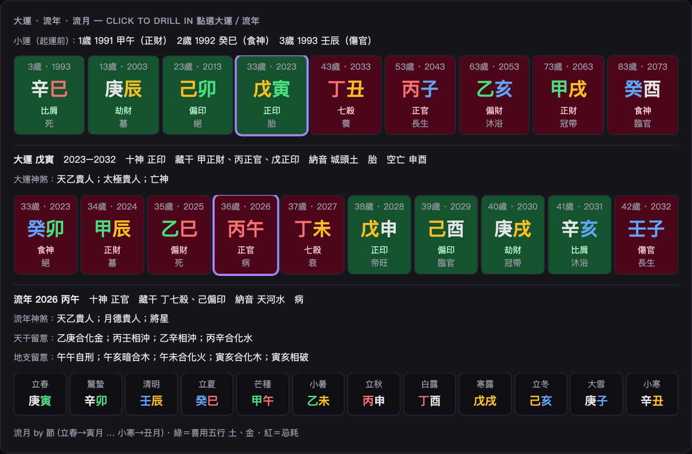

# 八字（四柱）圖解 · BaZi Visual Guide

把出生的**年、月、日、時**各換成一組「天干＋地支」，共四柱八個字——這就是「八字」。
Your birth **year / month / day / hour** each become a 干支 (heavenly-stem + earthly-branch) pair: four pillars, eight characters.

> 開啟 / Open: 首頁選 **BaZi · 八字（四柱）**，填生辰按 **Cast + Read**。時辰決定**時柱**，建議填。




## 命盤怎麼讀 / Reading the chart

```
 年柱   月柱   日柱   時柱      ← four pillars
 庚午   壬午   辛亥   乙未      ← 干支 (stem+branch)
 金火   水火   金水   木土      ← 五行 elements
```

- **日柱的天干＝日主（Day Master）**：代表「你自己」。上例日主＝**辛（金）**。
- 其他七個字是環繞日主的力量；看它們**生我／同我**（幫身）還是**剋我／我剋／我生**（耗身）。
- 由此判斷**身強 / 身弱**，再定**喜用神**＝對你最有利的五行。

## 完整排盤 / The full almanac sheet

八字卡片現在是一張完整的「四柱排盤表」（如周易大學堂等線上排盤的版面）：
The BaZi card is now a full 排盤 sheet in the layout of traditional online 四柱 calculators:

| 區塊 | 內容 |
|---|---|
| 表頭 | 日主（陰陽五行）、**胎元**［納音］、**命宮**［納音］、前後**節氣**交節時刻（天文曆精確到分）、**起運**（出生後幾年幾月幾天幾小時）、**交運**日期、**換運**尾數、公曆／**農曆**（生肖・時辰）|
| 四柱表 | 每柱的 **十神**（日柱＝元男/元女）、天干、地支（生肖）、**藏干**＋各自十神、**納音**、**十二長生**、**空亡**、**神煞** |
| 留意 | **天干**：五合（甲己合土…）、相沖；**地支**：六沖、六合、三合局、三會方、相刑／自刑／三刑、相破、相害、暗合 |
| 稱骨 | 袁天罡稱骨重量（農曆年月日＋時辰）與評語 |
| 大運 · 流年 · 流月 | 九步**大運**（起運歲・起始年・十神・長生，綠＝喜用、紅＝忌耗）→ 點選展開該運十個**流年** → 點選流年展開十二**流月**（依節起月），並列出該大運／流年的**神煞**與與原局的**刑沖合會留意**；起運前另列**小運** |

> 年柱以**立春**、月柱以十二**節**的精確交節時刻（太陽視黃經，`ephem`）分界，與坊間用近似節氣表的排盤可能相差數小時內的月柱；起運依「三日折一年、一日折四月、一時辰折十日」算到小時。晚子時（23:00 後）不換日柱。
> Year/month pillars switch at the minute-exact 立春 / 節; 起運 is computed at hour resolution.

## 命盤要素 / Key facts the app shows

| 欄位 | 意思 |
|---|---|
| day_master 日主 | 你的本命之氣（十天干之一）|
| strength 身強/身弱 | 日主旺或弱 → 決定喜忌方向 |
| favourable 喜用神 | 對你有利的五行（趨吉用神）|
| 大運 (timeline) | 每 **10 年** 一步的運勢柱；方向由「年干陰陽 × 性別」決定（陽男陰女順、陰男陽女逆），起運歲數由節氣距離換算 |
| ten_gods / hidden_stems / nayin / kong_wang / shensha | 四柱的十神、藏干十神、納音、空亡、神煞（同時餵給 AI 解讀）|
| tai_yuan / ming_gong / relations / qi_yun / cheng_gu | 胎元、命宮、刑沖合會、起運與交運、稱骨 |
| current_dayun / current_liunian | 現行大運與今年流年（含十神、神煞、與原局的留意）|

> 時間軸 Timeline：八字附 **大運**（10 年一柱）。綠＝喜用五行的運、紅＝忌神運。

## 名詞速查 / Glossary

| 詞 | 白話 |
|---|---|
| 天干 stem | 甲乙丙丁戊己庚辛壬癸（十個）|
| 地支 branch | 子丑寅卯…亥（十二個，配生肖）|
| 五行 | 木火土金水；相生相剋 |
| 日主 Day Master | 日柱天干＝命主本人 |
| 喜用神 | 補命局所缺、最有利的五行 |
| 十神 | 其他干相對日主的關係：比肩劫財／食神傷官／正偏財／正官七殺／正偏印 |
| 藏干 | 地支裡暗藏的天干（本氣・中氣・餘氣）|
| 納音 | 六十甲子各配一「音」（海中金、爐中火…）|
| 空亡 | 該柱所在「旬」缺的兩個地支 |
| 神煞 | 天乙貴人、文昌、桃花、驛馬、華蓋…等吉凶星 |
| 胎元／命宮 | 受胎之月的干支／由月、時推出的命宮干支 |
| 起運／交運 | 出生後多久開始行大運／實際交運的日期 |
| 稱骨 | 袁天罡稱骨算命：年月日時各配重量，合計對應評語 |
| 大運 | 人生分段（每 10 年）的大環境 |

> 排盤以可驗證的錨點校準（日柱 2000-01-07＝甲子日、年柱 1984＝甲子年），節氣月界為標準 ±1 日近似。

## 旺衰與喜用神 / Strength and the useful god

- **月令**：日主對月支五行定旺／相／休／囚／死（+3 … −3）。
- **通根**：四柱地支藏干逐一計分（本氣 1.0、中氣 0.5、餘氣 0.3；月令 ×1.5、日支 ×1.2），比劫與印為生扶，財官食傷為剋洩耗。
- **透干**：年月時天干各 ±1。
- 生扶 ÷（生扶＋剋洩耗）＝得力比：≥58% 身強、≤42% 身弱、其間中和；無根且 <22% 判「疑從格」。
- **用神**：扶抑為主（身強以官殺或財為先，身弱以印或比劫為先，依剋洩耗中何者最重而定），另列**調候**（冬火夏水）與**月令格局**（月支本氣十神）。所有計分項逐條列在排盤步驟，可自行核對。

## 真太陽時 / True solar time

勾選「真太陽時」且有經度時，八字、紫微、梅花、四柱推命、奇門、六壬、鐵板都改以**出生地真太陽時**排干支：時鐘時間 → 當地平太陽時（經度差 ×4 分鐘）＋ 均時差，用天文曆直接取最近的太陽中天時刻換算。西洋占星與 Jyotiṣa 用 UT，不受影響。


## 神煞全表 / The shensha table

每柱、每步大運與流年都標出落在該干支的神煞（`shensha`），全盤格局（三奇、拱祿、年命納音天羅地網）在 `shensha_chart`。查法依《三命通會》／《協紀辨方書》常用口訣：

| 依據 | 神煞 |
|---|---|
| 年干／日干 → 地支 | 天乙貴人、太極貴人、文昌貴人、國印貴人、福星貴人；詞館（干支） |
| 日干 → 地支 | 天廚貴人、祿神、羊刃、學堂、天官貴人、天福貴人、金輿、流霞、血刃 |
| 月支 → 干／支 | 天德貴人、月德貴人、天德合、月德合、天醫 |
| 年支／日支 三合 | 將星、驛馬、華蓋、桃花（咸池）、劫煞、亡神、災煞 |
| 年支 | 紅鸞、天喜、孤辰、寡宿、太歲十二神（太陽、太陰、官符、死符、歲破、龍德、白虎、福德、喪門、吊客、病符）；元辰、勾煞、絞煞（依陰陽男女順逆） |
| 日支 ↔ 地支 | 天羅（戌亥）、地網（辰巳）互見 |
| 柱干支 | 四廢、天赦、魁罡、金神；日柱：十惡大敗、陰差陽錯、日德、日貴、十靈、六秀、八專、九醜；日柱／時柱：孤鸞 |
| 全盤 | 三奇貴人（甲戊庚／乙丙丁／壬癸辛 順布）、拱祿（日時同干夾祿）、年命納音天羅地網 |

`shensha_for(..., full=False)` 可只取舊版的核心 29 項。神煞只是參考層，旺衰與用神的判斷不依賴它。
