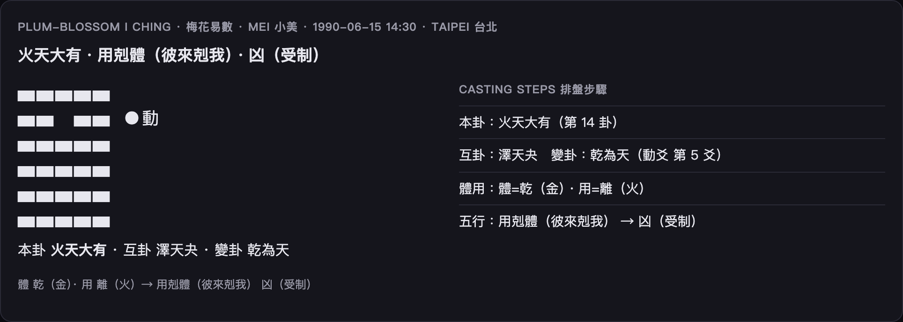

# 梅花易數圖解 · Plum-Blossom I Ching Visual Guide

用出生日期的數字「起卦」，得到一個**六爻卦象**，再用體用五行生剋判吉凶。
The birth date's numbers cast a **hexagram** (six lines); the 體/用 five-element relation gives the verdict.

> 開啟 / Open: 首頁選 **Plum-Blossom I Ching · 梅花易數**。只需日期即可（時間起卦）。



## 卦象怎麼讀 / Reading the hexagram

```
 ▅▅▅▅▅          ← 由上而下六爻（陽爻＝實線，陰爻＝中斷）
 ▅▅　▅▅ ●動     ← 標 ●動 的是「動爻」
 ▅▅▅▅▅
 ...
 本卦 火天大有 · 互卦 … · 變卦 …
 體 乾(金) · 用 離(火) → 用剋體（彼來剋我）凶（受制）
```

- **本卦**：當下的卦（主訊息）。**互卦**：藏在中間的過程。**變卦**：動爻一變後的結果走向。
- **體用**：含動爻的那個三爻卦＝**用**（外、他人、事情）；另一個＝**體**（自己）。
- 看體用兩者的**五行生剋**：用生體/比和＝吉；用剋體/體生用＝凶。

## 命盤要素 / Key facts

| 欄位 | 意思 |
|---|---|
| 本卦 ben | 主卦名（六十四卦之一）|
| 互卦 hu | 事情的內在過程 |
| 變卦 bian | 動爻變後的結果 |
| 體用關係 | 體與用的五行生剋（吉/凶判語）|
| 斷 verdict | 吉 / 小吉 / 平 / 凶 |

## 名詞速查 / Glossary

| 詞 | 白話 |
|---|---|
| 爻 | 卦的一條線，陽（⚊）或陰（⚋）|
| 八卦 | 乾兌離震巽坎艮坤，各配五行 |
| 動爻 | 會變動的那一爻，牽動變卦 |
| 體 / 用 | 自己 / 外境；以生剋論吉凶 |

> 時間起卦：日期（＋seed）決定上卦、下卦、動爻，完全可重現、零前視。
