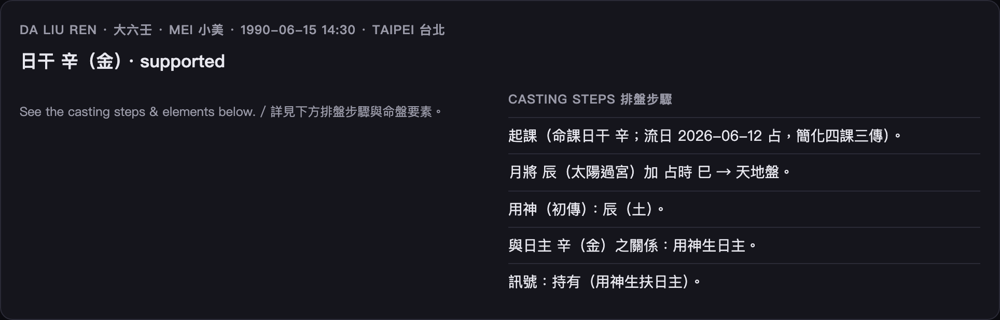

# 大六壬圖解 · Da Liu Ren Visual Guide

「三式」之一：以日干與月將、時辰起「**四課三傳**」，看事情的起承轉合。
One of the Three Boards: from the day-stem, month-general and hour it raises the **Four Lessons & Three Transmissions** — the arc of a matter.

> 開啟 / Open: 首頁選 **Da Liu Ren · 大六壬**。日干取自八字日柱。



## 怎麼讀 / Reading it

```
 日干 辛(金)
 月將 / 用神 …
 (四課：日干/日支/… 三傳：初/中/末)
 用神生扶日干 → supported（吉）/ 受剋 → 凶
```

- **日干**：代表問事人（取自八字日柱）。
- **月將、用神**：事情的主軸與關鍵點。
- 看**用神對日干的生剋**：生扶＝順、受剋＝阻。

## 命盤要素 / Key facts

| 欄位 | 意思 |
|---|---|
| day_stem 日干 | 問事人本身（日柱天干）|
| day_stem_elem | 日干五行 |
| liuren_regime | supported（用神生扶）/ 受剋 |

## 名詞速查 / Glossary

| 詞 | 白話 |
|---|---|
| 四課 | 由日干日支起的四組關係 |
| 三傳 | 初傳・中傳・末傳，事情的起中末 |
| 用神 | 一課中最關鍵、定吉凶的神煞 |
| 月將 | 太陽所在的宮位之神 |

> 起課採簡化法（已加註）；日干以 JDN 校準的八字日柱取得，純確定性。
