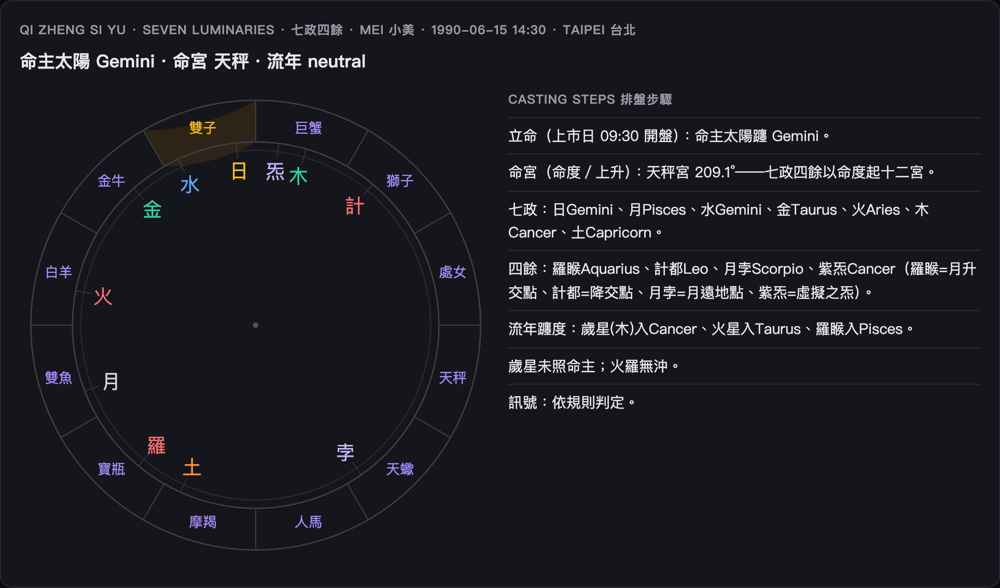

# 七政四餘圖解 · Seven Luminaries Visual Guide

中式天文星命：用**真實天文經度**排「七政」（日月＋五星）與「四餘」（羅計孛炁）的星盤，再立命宮看流年。
Chinese astral astrology: a star chart of the **七政** (Sun, Moon, 5 visible planets) plus the **四餘** (4 shadow points), from real ecliptic longitudes, with a rising 命宮.

> 開啟 / Open: 首頁選 **Seven Luminaries · 七政四餘**。**命宮（命度）需要時辰＋出生地**。

## 命盤怎麼讀 / Reading the chart

- **七政**：日、月、水、金、火、木、土——落在黃道十二宮哪一宮。
- **四餘**：羅睺（月升交點）、計都（降交點）、月孛（月遠地點）、紫炁（虛擬之炁）——中式特有的四個「隱曜」。
- **命宮（命度）**：上升點所在，立一生之命；以命度起十二宮。
- 流年看**歲星（木）拱照命主**（吉）或**火星／羅睺沖剋命主**（凶）。

## 命盤要素 / Key facts

| 欄位 | 意思 |
|---|---|
| ming_zhu_sign 命主太陽 | 命主（太陽）所躔星座 |
| ming_gong_sign 命宮 | 命度／上升所在（需時辰＋地點）|
| jupiter / mars / rahu sign | 流年歲星・火星・羅睺落點 |
| qizheng_regime | benefic（歲星拱照）/ malefic（火羅沖剋）/ neutral |

## 名詞速查 / Glossary

| 詞 | 白話 |
|---|---|
| 七政 | 日月＋金木水火土，可見七曜 |
| 四餘 | 羅睺・計都・月孛・紫炁（隱曜）|
| 命宮 / 命度 | 出生時東方地平的黃道度數 |
| 拱照 / 沖剋 | 吉星照命 / 凶星犯命 |

> 七政為真實天文經度（`ephem`）；四餘用標準平均根數；命宮共用占星的上升幾何。
