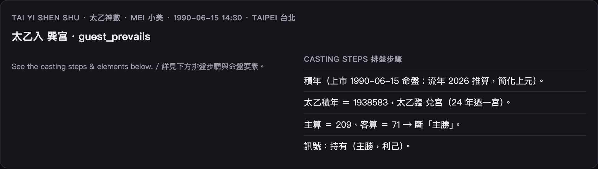

# 太乙神數圖解 · Tai Yi Shen Shu Visual Guide

「三式」之一：以累積年數推「太乙」在**九宮**的落點，並看**主算 vs 客算**（主客勝負）。
One of the Three Boards: from accumulated years it places 太乙 in the **nine palaces** and weighs **host vs guest** (who prevails).

> 開啟 / Open: 首頁選 **Tai Yi Shen Shu · 太乙神數**。



## 怎麼讀 / Reading it

```
 太乙入 巽宮          ← 太乙落在九宮的哪一宮
 主客：host_prevails / guest_prevails   ← 主算與客算誰勝
```

- **太乙宮**：太乙神當下所在的宮，定大局氣象。
- **主客**：主算代表「我方／既有」，客算代表「彼方／來者」；比較兩者數，定勝負傾向。

## 命盤要素 / Key facts

| 欄位 | 意思 |
|---|---|
| taiyi_palace 太乙宮 | 太乙所入之宮 |
| host_guest 主客 | host_prevails（主勝）/ guest_prevails（客勝）|

## 名詞速查 / Glossary

| 詞 | 白話 |
|---|---|
| 太乙 | 三式中代表「天一」的神，主大勢 |
| 九宮 | 太乙行走的九個方位 |
| 主算 / 客算 | 我方 / 對方的力量數，比之定勝負 |

> 起算採簡化法（已加註）；累積年數→九宮落點，純確定性、無前視。
