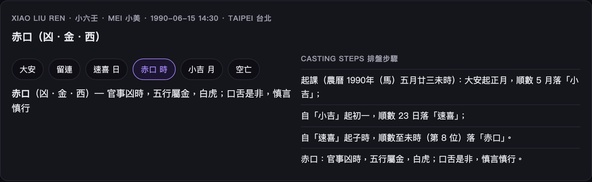

# 小六壬圖解 · Xiao Liu Ren

六個宮位（大安 留連 速喜 赤口 小吉 空亡）依**農曆月、日、時辰**順數：大安起正月數到生月，再從該宮起初一數到生日，再從該宮起子時數到生時，落在哪一宮就是答案。
Six palaces counted by lunar month, day and hour from 大安; the final palace is the verdict.

> 開啟 / Open: 首頁選 **Xiao Liu Ren · 小六壬**。

| 宮 | 五行 | 方位 | 吉凶 | 意 |
|---|---|---|---|---|
| 大安 | 木 | 東 | 吉 | 求謀安穩，事事平安 |
| 留連 | 水 | 北 | 凶 | 事難成，拖延反覆 |
| 速喜 | 火 | 南 | 吉 | 喜訊將至，宜速不宜遲 |
| 赤口 | 金 | 西 | 凶 | 口舌是非，慎言慎行 |
| 小吉 | 木 | 東 | 吉 | 小有所成，貴人相助 |
| 空亡 | 土 | 中 | 凶 | 落空無果，宜守不宜攻 |

排盤步驟會列出三次數算的落宮；時辰未知以午時計。
